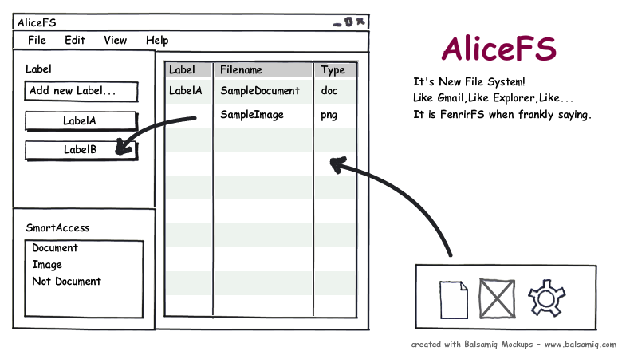
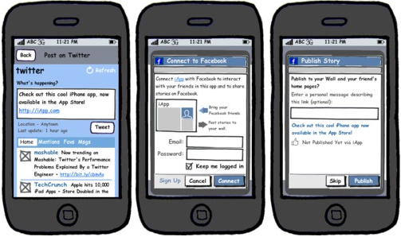

以前からモックアップの作成に使っていた「[Balsamiq Mockups][1]」ですが、  
久しぶりに仕事でがっつりWebUIをやることになったのでチェックしてみたところ、  
かなりアップデートしていたのでご紹介したいと思います。

「Balsamiq Mockups」はAIRソフトとして配布されていて、WEB版もあります。  
デスクトップ版は79ドルするのですが、機能制限ありなら無料で使えます。  
無料版だとPNG形式での出力などができませんが、スクショ撮れる範囲で作れば問題ないと思います。  
以前はなかったのですが、7日間試用できます。

で、ここからが最近知ったことなのですが、コンポーネントを追加できるようになってました。  
「[Mockups To Go][2]」というサイトで色々紹介されてます。  
ここでDLしたファイルをドロップすると、そのまま使えるようになっているみたいです。  
iPhoneとかfacebookなどに特化したUIが色々あるみたいですよー。  

その他、[UML用のコンポーネント][3]が追加できるようになってたり、HTMLやXAMLなどで出力できるようなツールが出ていたりとかなり色々できるようになってました。  
（最近チェックしたので前からあったかもしれませんが・・・）

モックアップツールとしては有名なツールですが、  
実際使いやすく、ラフに仕上がるので気に入っています。  
完全にUIデザイナーになる！ってことなら買ってもいいかなと思っているのですが、  
先の見えない仕事なのでちょっと決断しかねてます・・・。

 [1]: http://www.balsamiq.com/
 [2]: http://mockupstogo.net/
 [3]: http://blog.rainer.eschen.name/mock4u/
