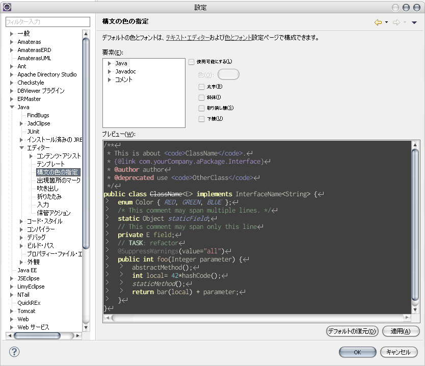

メイン言語がJavaなので、Eclipse使ってます。  
重くて時々しんどいけど、便利なプラグインがいっぱいあってトータルではラブラブ。  
Javaが好きでJavaやってるのか、この子が好きでJavaやってるのかもうよくわかりません。  
カスタムの自由度がかなりあるので、今までもスプラッシュ画像変えてやる気出したり、Redmineと連携させてTODO管理したりと色々やってました。

でも、エディターの背景を黒にする・・・これだけはやってませんでした。

だってなんか・・・Geekっぽい・・・。  
いかにも昔っからプログラミングやってるぜ！根っからのエンジニアだぜ！って感じ。（超偏見）

・・・と、思っていたのですがふと思いました。  
私、黒大好きじゃん、と・・・。

結局そこかよって感じですが、エディターの色カスタムしちゃいました。  
なんかほら、黒背景だと目に優しいらしいじゃないですかー。  
今までほんとかよ、って思ってたんですが、まあ試してやろうかなと。

Eclipseは設定画面からエディターのフォントとか色とかを変更できるようになっているので、このへんをちまちまいじるのかーとちょっと気が遠くなりそうだったのですが、  
こういう需要は絶対あるでしょ、と思って検索かけたら速攻見つかりました。

[Eclipse Java Color Themes][1]

簡単！上記サイトからファイルをDLして入れ替えるだけ！  
これで冒頭の画像のような環境で開発できます。  
私は「Zenburn」というテーマを使ってます。  
なんか確かに目に優しい気がする！

ちなみに、プラグインいれて他のエディター使ってる方や、その他の言語も扱っている方はやっぱり自分でちまちま変える必要あります。  
私も結局かなり頑張りました・・・。JSPとかXMLとかHTML・CSSとか・・・。  
Amaterasにかなりお世話になっていたので。  
それでも、DLしたテーマをお手本に色を変更していけば、センスの良い環境にできるのではないでしょうか。

てなわけで一応満足。  
最近知った[プログラミング時に最適なフォント「Inconsolata」][2]もあわせて利用中です。

やっぱり開発環境は快適＆楽しくなければ！

 [1]: http://srand2.blogspot.com/2009/08/eclipse-color-themes.html
 [2]: http://yamashita.dyndns.org/blog/inconsolata-as-a-programming-font/
