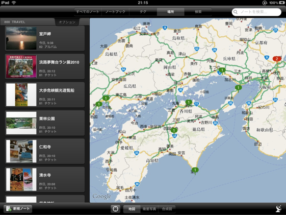
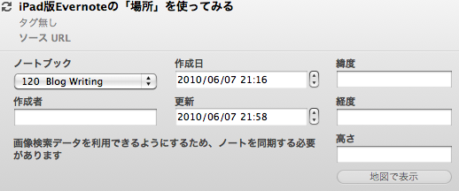
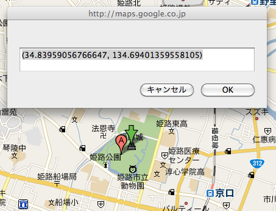

iPhoneでは位置情報をつけて写真を撮ることができます。  
今までは特に意識しておらず、この情報を使って何かをしようと考えたこともなかったのですが、  
せっかく喫茶店でご飯を撮ったり旅行先にチケットを写真で残しておいたりしているので、  
位置情報を使って地図と関連付けられれば面白いかもなぁーとちょっと色々調べてみました。

で、調べてみると色々勘違いしていたことが判明・・・。  
そもそも、どのアプリで写真撮っても必ず位置情報が入ると思っていたのですが、  
そういうものでもないようで、少なくとも私がずっと使っていたカメラアプリでは位置情報が入りませんでした。  
かつ、加工するとけっこう消えちゃったりするみたいで・・・。  
このへんアプリによって挙動が違うのでややこしいのですが・・・。

また、私は撮ったあとほとんどの写真をFlickrにアップしているのですが、  
この時に位置情報が抜け落ちてしまったり、  
Evernoteアプリの場合、アップした場所の位置情報をセットしてしまっていたり・・・。  
気づいてみれば、今までの写真はほぼ全て不正確な位置情報つきの写真になってしまっていました・・・。  
写真をコピーしてメールで送れば大丈夫みたいなのですが、それは面倒くさすぎる・・・。

・・・というわけで、位置情報を維持して他サービスに渡すのはあきらめて、  
渡した先で編集して正確な位置情報をセットすることにしました。  
（そもそもiPhoneの位置情報の精度も微妙なので・・・）

と、その前にどのサービスで地図管理するのか、ですが・・・。  
冒頭画像の通り、iPad版Evernoteを利用することにしました。  
Flickrでも地図機能があるみたいなのですが、基本英語＆アクセス手段があまりないので・・・。  
普通に自分で見たり友人にちょっと見せたりしたいだけなのでEvernoteで十分かなーと。

では、正しい位置情報をセットする方法です。  
まず、Evernote側（以下はMacクライアントを使った説明です。）の[表示]-[ノート情報を表示]を選択しておきます。  
こうすると、各ノートの作成日や位置情報を入力できる欄が表示されるようになります。

この緯度と経度の部分に正しい位置情報を入力します。

正しい位置情報は、GoogleMapから取得出来ます。  
以下のサイトにあるブックマークレットを使うと簡単に取得できますよ。

[グーグル マップで地図の位置情報がすぐわかるブックマークレット][1]

以上の方法で今まで間違っていた位置情報を修正してできたのが冒頭の地図です。  
今年のGWの記録が一目でわかるようになりました。  
見た目もきれいだし、大満足です。

iPadアプリ上で情報編集できたら言うこと無しなのですが。  
Evernoteクライアントはどんどんアップデートしているのでこのへんは今後に期待！

 [1]: http://aki19.tumblr.com/post/669373664
