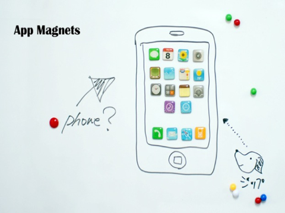

普段ブログの下書きはiPadでやっていましたが、  
今まで一度も最後までiPadのみで作業したことはありませんでした。  
実験もかねて今回はiPadのみでやってみたいと思います。  
ただ、iPadだからといって制限のある文章にはしたくないので、  
普段同様図を使ったりリンクを貼ったりしてみたいと思います。

といっても今回書くネタがあんまり思いつかなかったので、  
ちょっと欲しいなと思っているマグネットをご紹介。

かわいい&#8230;。ちょっと前に話題になりましたね。  
マグネット自体の使い道がないので購入は保留してます。

お店のリンクはこちら。

  <strong><a rel="nofollow" target="_blank" href="http://www.rakuten.co.jp/hinata-d/">【楽天市場】世界のデザイン雑貨を毎日の生活に。：ヒナタデザイン[トップページ]</a></strong>
 
  
  

  

  
  

    <strong></strong>
  

上図はまずはじめにSafariでスクショを撮って、その後Photoshop ExpressでRotateしたりCropしたりして欲しい部分だけ切り出しました。  
画像の張り付けは、このブログはWordpressなので公式アプリを使ってアップロードして挿入。  
ただこのアプリ、なんかすごく不安定で何度も落ちたので文章はDraftPadで書きました。  
リンクは以下のShareHtmlブックマークレットを使って作ってます。  
文章の最後のアプリ紹介もここのブックマークレット使ってます。便利すぎ。

  <strong><a rel="nofollow" target="_blank" href="http://iphone-diary.com/?p=7810">アプリ紹介とBlog紹介の自動HTML生成 – 派生まとめ | 普通のサラリーマンのiPhone日記</a></strong>
 
  
  

  

  
  

    <strong></strong>
  

最後にブログに投稿します。  
公式アプリを立ち上げてDraftPadからコピペ。  
Htmlとかぐちゃぐちゃ入ってるけど気にせずPublish！  
これで投稿できました。

けっこううまくいったのでiPadで全部やっちゃうのは個人的にはけっこうありかも。  
長文入力も慣れてきたのか思ったより間違えずにいけました。  
変換がダメなのにはちょっと困ったけど。  
Wordpress公式アプリが不安定なのがちょっとネック。  
今後のアップデートに期待ですかねー。

最後に今回使ったアプリを紹介しておしまいにしたいと思います。

  <a rel="nofollow" target="_blank" href="http://itunes.apple.com/jp/app/wordpress/id335703880?mt=8&#038;at=11l9Ag"><strong>WordPress 2.6（iOS 4.0 テスト済み）</strong></a> iPhone、iPod touch および iPad 互換 iOS 3.1.2 以降が必要 カテゴリ: ソーシャルネットワーキング 価格: 無料 更新:2010/09/30 

  <a rel="nofollow" target="_blank" href="http://itunes.apple.com/jp/app/adobe-photoshop-express/id331975235?mt=8&#038;at=11l9Ag"><strong>Adobe Photoshop Express 1.3.2（iOS 4.0 テスト済み）</strong></a> iPhone、iPod touch および iPad 互換 iOS 3.0 以降が必要 カテゴリ: 写真 価格: 無料 更新:2010/09/29 

  <a rel="nofollow" target="_blank" href="http://itunes.apple.com/jp/app/draftpad/id358067114?mt=8&#038;at=11l9Ag"><strong>DraftPad 1.2.1</strong></a> iPhone、iPod touch および iPad 互換 iOS 3.1 以降が必要 カテゴリ: 仕事効率化 価格: 無料 更新:2010/08/01 

