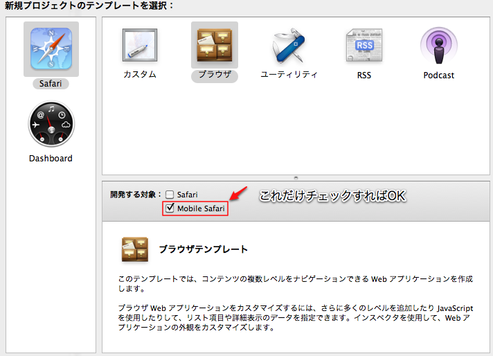
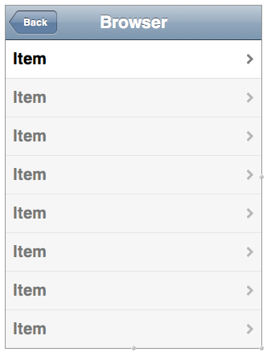
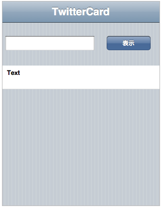
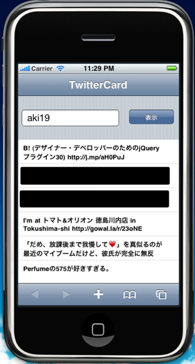

iPhoneアプリ作りたいなー、とけっこう前から思っていて、  
Objective-Cをちょっと勉強していたのですが、  
仕事で勉強しなくちゃいけない言語が増えて、どうにも進まず・・・と思っていたら、  
こちらの記事を見つけました。

[JavaScriptでiPhoneアプリを楽々作成][1]

そういえば「[iPhoneアプリケーション開発ガイド　―HTML+CSS+JavaScript による開発手法][2]」という本も出ていたなーと思い出し・・・。

JavaScriptなら会社でもやっているのでちょっと試してみました。

開発環境は、せっかくなのでDashcode。  
たぶんXcodeとかと一緒にDLしたのか・・・あまり覚えていないのですが・・・。  
とにかくこれを使えば、UIパーツの配置とかも楽にできるのでこれにします。

＊以下のDashcodeの使い方は何かを見て勉強したわけじゃないので、  
色々間違っているかも・・・です。

①新規作成  
Dashcodeを起動して、テンプレートを選びます。

ブラウザを選ぶとあらかじめいくつかのパーツが配置されたテンプレートになります。  
すぐにテストできる感じ。  
カスタムだと本当にまっさらから作ることになります。  
今回はブラウザからスタートしてみます。

②開発（デザイン）  
ブラウザでスタートすると、以下のような画面になります。

この画面をいじっていきます。  
Dashcodeの左側に、配置しているパーツがツリー形式で並びます。  
表示メニューから下部にソースコードを表示しておくと便利かも。

一応、今回作りたいのは入力したTwitterユーザーのタイムラインを表に表示させるWebアプリ。  
本当は名刺みたいに、ユーザーの情報を色々表示させて、  
フォローボタンも用意して・・・みたいなアナライズ系？のアプリにしたい。  
けど、タイムライン表示、までできればあとはJSの問題なので・・・  
今回はここまでやってみます。

ぐちゃぐちゃいじってこんな感じに。  
パーツはライブラリからドラッグ＆ドロップ。  
配置とか細かいサイズの調節はインスペクタから設定できます。

③開発（プログラム）  
main.jsにいくつかアクションが定義されているので、  
不要なもの＆バッティングするものは削りましょう。  
ブラウザテンプレートからはじめる場合、表に色々バインドされてたりするので  
注意してください。  
今回はこちら側が作成したデータをつめこんでいくのでデータのタイプは「静的」で。

今回は、「表示」ボタンを押すことでデータの取得を行ないたいので、  
このボタンにアクションを割り当てます。  
方法は簡単。  
ボタンのインスペクタのビヘイビア画面にあるonclickイベントのハンドラに、  
アクションを設定すると、コードが自動生成されます。  
あとはもうこの部分にTwitterからタイムラインデータを取得するJSを書くだけ。  
データをとってきたら要素を作成して表の子供につめこんでいきます。  
jQueryももちろん使えます。

④実行  
実行ボタンを押すと、シミュレータが起動します。

あ、できたー。

このプログラムは、シミュレータでも確認できますし、  
ネットにあげれば実機でももちろん確認OK。無料です。

ホントは、こっからPhoneGapとかでアプリ化するところですが、  
ちょっと長くなったので今回はここまで。

 [1]: http://pitecan.com/iPhoneSamples/clock/
 [2]: http://www.amazon.co.jp/dp/4873114616
