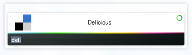

小ネタ＆自分用メモです。

会社のWinPCでは「[Launchy][1]」というランチャーソフトを使っているのですが、  
このソフトを使って自分のDeliciousブックマークを表示する方法をメモします。

Launchyは、検索対象として任意のディレクトリやファイルタイプを指定できます。

そこで、まず始めに[Delicious][2]にて自分のブックマークをエクスポートしておきます。（Settings＞Export / Backup Bookmarks）  
次に、そのファイルをIEなどでインポートします。  
すると、IEの場合お気に入りフォルダに「.url」という拡張子でひとつひとつのファイルとして取り込まれます。  
このフォルダをLaunchyに検索対象として登録し、インデキシングが完了すれば準備OK。

例えばDeliciousにAliceSystemsを登録していた場合、「Al」とタイプすると候補として表示されます。  
選択すればデフォルトのブラウザで開かれるはず。

Launchyはホットキー割り当てなどですぐ起動できるので、即アクセスできて便利ですよー。

 [1]: http://www.launchy.net/
 [2]: http://delicious.com/
