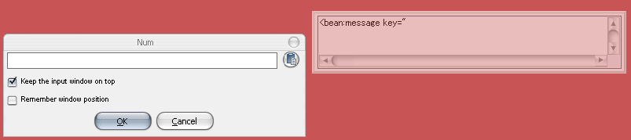
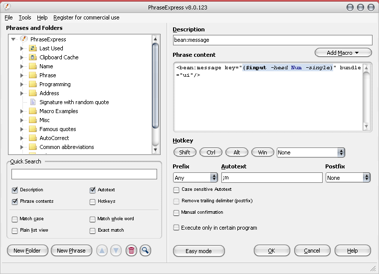
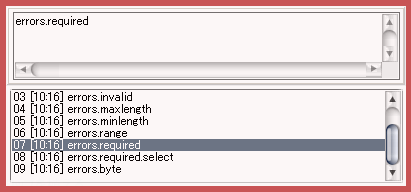
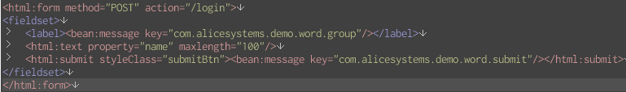

すでに作成したJSPの文字列を後からリソース管理することになった場合の話。  
先にやっとけよという話ですが、タイトルで挙げた二つのソフトを使ってかなり楽に作業できたので、  
メモ的にエントリー。Windows限定ですが、Macでも代替ソフトは色々あるはず。

「[PhraseExpress][1]」は、MacでいうところのTextExpanderです。嬉しいことに非商用なら無料。  
あらかじめ登録した省略語を入力すると文字を置き換えてくれる便利ソフトです。  
例えば「/yoro」を入力すると「よろしくお願いします。」に変換できたり。  
詳しくは[こちらの記事][2]を参考にどうぞ。

「[GhostBoard][3]」は、クリップボード監視ソフトです。  
あまりこの手のソフトを使ったことがなかったので他のソフトでもできるかもしれませんが、  
「GhostBoard」の以下の点が気に入って使っています。

・使用中のアプリケーションから入力フォーカスを切り替えずに使える  
・全部キーボードから操作できる  
・半透明ウィンドウで目立たない  
・定型文も保存できる

ではリソース対応開始。  
やり方は・・・

①リソースファイルに定義しまくる。  
これはもうとにかく自分で頑張る。

②定義したキーをコピーしまくる。  
「GhostBoard」にどんどん登録されていきます。

③「PhraseExpress」に以下のようなフレーズを登録する。  

今回、呼び出しは「;m」で行うように設定しました。  
{#input -head Num -single}は、フレーズ呼び出し後すぐに表示されるダイアログに値を入力すると  
その値と置き換わります。  
今回カーソル位置はそのまま最後で良いので特に何もせず。  
もちろんカーソル位置を好きな場所に指定することもできます。

④JSPでフレーズ呼び出し  
メッセージを埋め込みたい場所で先ほど登録したフレーズを呼び出します。  
この場合は「;m」。

⑤「GhostBoard」の履歴をたどってキーをペースト  

フレーズを呼び出すとダイアログが表示されるので、テキストフィールドにリソースキーを入力します。  
この時に「GhostBoard」が活躍！  
Ctrl上下で履歴を辿り、埋め込みたいキーが見つかったらすぐにペースト。  
「GhostBoard」は入力フォーカスを奪わないのでウィンドウを切り替えることなくすぐにペーストできるのです。  
ダイアログOKで埋め込み完了です！

あとは④⑤を繰り返すだけ！  
慣れればホント速いです。後は私がメッセージを埋め込みたい場所にいかに速く移動するか・・・ぐらい（笑）

もちろんその他の用途でも「PhraseExpress」＆「GhostBoard」はとってもよい子なので、おすすめです！

 [1]: http://www.phraseexpress.com/
 [2]: http://yoshikazuasada.biz/note/tools/2536
 [3]: http://code.google.com/p/kusu/wiki/GhostBoard
