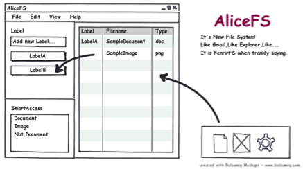
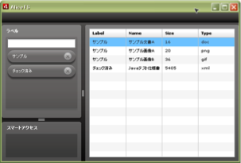

ここ最近AIRの勉強として上図のようなファイルシステムみたいなものを開発してました。  
で、できたのが下図のようなもの。  

ファイルをアプリにドロップするとファイル情報が表に追加されます。  
新規ラベルを作成すると左パネルに作成済みラベルが並びます。  
ファイル表からラベルにドロップするとドロップ先のラベルがファイルと関連付けられます。

・・・とここまではうまくいったのですが、  
肝心のファイルをダブルクリックで開く・・・が出来ない！

ちょっと調べてみたところ、同じように困っている方のブログによれば、  
AIRではファイルを関連付けられたアプリケーションで開くような命令がないらしい・・・。  
その方はJavaでそういう機能をつくって同時起動してその部分はJavaに委託する・・・といった方法を  
とられていました。

そんな馬鹿な。スマートじゃない・・・。

・・・というわけでこのアプリはここまで。  
残念ですが事前に調べなかった自分が悪い・・・。  
これに懲りずに勉強続けたいと思います。
