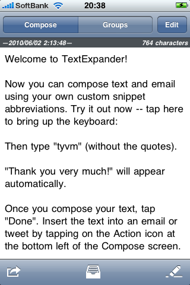
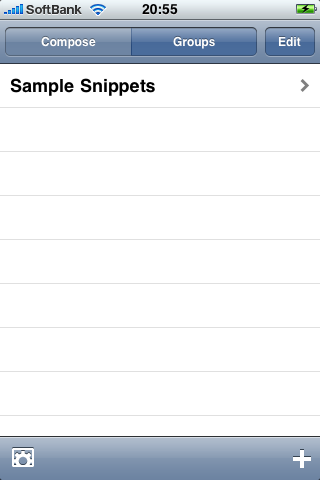
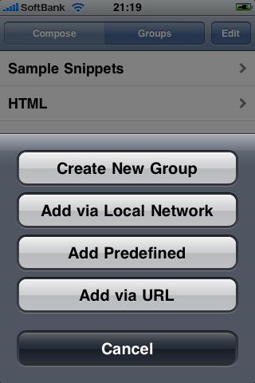

[TextExpander][1]は、Macで有名な入力補完ソフトウェアです。  
例えば「yo」を入力したら、「よろしくお願いします。」になるように設定しておくと、以後「yo」と入力すると自動的に「よろしくお願いします。」に変換される・・・というものなのですが、このソフト自体のすごさは以下の記事を参考にしてください。

[寿命ものびるかも？ タイピング速度を劇的に向上させる TextExpander を使い込む幸せ][2]

今回は、TextExpanderのiPhone（iPad互換）アプリを購入したので、使い方とか対応アプリとかiPadとの連携方法とかをまとめてみたいと思います。

■iPhoneでの使い方  

起動すると、上図のような画面になります。  
この「Compose」はエディター。スニペットの登録は「Groups」から行います。  
なお、設定画面には「Groups」から進むことができます。

「Groups」では、スニペットをまとめるグループの登録やいくつかサンプルとして入っているスニペット集（HTMLとか・・・）をロードすることができます。  
スニペットを実際に登録するのは、作成したグループの中で。  
スニペットでは、Macソフト同様入力後のキャレット位置（%|）も決められます。  
このあたりの記法は他にも色々あるみたいです。

■連携アプリ  
登録したスニペットはMac版とは違い、残念ながらどこでも使えるわけではありません。  
対応アプリのリストは[こちら][3]。

自分が持っているのは「Twitter for iPhone」、「2Do」だったので試しに使ってみました。  
どちらのアプリも、設定画面にTextExpanderと連携するかどうかを設定する項目があるのでONにしておきましょう。  
特に「Twitter for iPhone」は、無料にもなったことですし、よく使うハッシュタグとか、他サービスと連携させるための単語を登録しておくとツイートするときに便利かもしれません。

私が普段常用しているTwitterクライアントは「Twitterrific」なのですが、残念ながら直接変換には対応していませんでした。  
ただ、スニペットを飛ばすことはできるみたいです。  
TextExpanderの設定画面にTwitterクライアントを設定する項目があるので、ここで候補として表示されるクライアントならばスニペット画面からクライアントに送ることができます。

■iPadとスニペットを共用する  
長文を書く頻度はiPadのほうが多いかと思います。  
iPhoneで作ったグループは同ネットワーク上のiPadと共用することができます。逆もOK。  
やり方は、どちらのデバイスでもTextExpanderを起動させておき、ロードしたいデバイス側の「Groups」画面の＋アイコンをタップ。

表示されるメニューから「Add via Local Network」を選択します。  
するとデバイス名が表示されるのでタップ。  
デバイス内のグループが表示されるので、ロードしたいグループを選択してください。  
これで選択したグループがもう一方のデバイスにも登録されます。

ちなみに、逆に一方のデバイスにグループを送ることもできます。  
方法は、「Snippets」画面の左下にある送るアイコンから。

■iPad版の注意点  
現時点ではiPadでも使えるものの、iPad用のUIはありません。  
iPhoneの画面になってしまいます。  
また、iPad版の「Twitterrific」に送ることはできないみたいです。  
つまり、今のところ私が使えるiPadアプリでは使えない・・・残念です。

あんまり連携アプリ持っていなかったので、エディター系の連携アプリの購入を検討中です。  
WriteRoomとか・・・。  
iPadで使いたいので、早くiPad対応＋Tx連携アプリが増えればなぁーと思います。

 [1]: http://www.smileonmymac.com/TextExpander/
 [2]: http://cyblog.jp/modules/weblogs/1831
 [3]: http://www.smileonmymac.com/TextExpander/touch/applist.html
