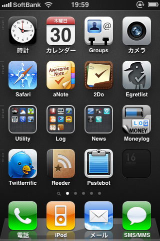

画像は現在のホーム画面です。

私は、「このアプリいつ頃アップデートするのかなー」「次のアップデート内容何かなー」とかが気になってしょうがないタイプの人間なので、

ちょっとでも気に入ったアプリは、開発状況等をちゃんとチェックしたい！ということで、ブクマ＆公式ブログを購読、なんてことを今までけっこうしてました。

が、たくさんのアプリをチェックしていると、開発者が外国人・・・ってことが多々あります。

ブログの場合、長文だったり、アプリの開発状況とは直接関係ない記事だったり、リリースまで更新がなかったり・・・ということがけっこうあり、

英語が苦手な私としてはなかなか厳しいものがありました。

しかし昨今のTwitterブームにより（？）、Twitterにて更新通知・開発状況報告、を行っているアプリがけっこうあったので、

私もTwitterでチェックすることにしました。

Twitterだとひとつひとつが短いのでなんとか英語も理解できますし、基本的にアプリの公式アカウントなので関係のない情報がないんですよね。

また、アプリによってはプロモコードを配布してくれることも！

今回は冒頭のホーム画面に置いているアプリから、いくつかTwitterアカウントをまとめてみたいと思います。

2Do - Todo List, Tasks &amp; Notes

Beehive Innovations Services無料posted with<a href="https://mama-hack.com/app-reach/" title="アプリーチ" target="_blank" rel="nofollow">アプリーチ</a>

[@Guided Ways][1]  
最近、for iPadのスクショを公開していたのでもうすぐなのかも。楽しみです。

Egretlist（公開終了）

[@egretlist][2]  
Tipsとかは別途Tumblrで紹介されてます。

Convertbot（公開終了）

 [@tapbots][3]  
他、WeightbotやPastebotの開発元でもあります。

Momento - プライベート日記

d3i Ltd無料posted with<a href="https://mama-hack.com/app-reach/" title="アプリーチ" target="_blank" rel="nofollow">アプリーチ</a>

[@MomentoApp][4]  
iPad版も開発中っぽいですが、更新はまだ先の模様。

Twitterrific: Tweet Your Way

The Iconfactory無料posted with<a href="https://mama-hack.com/app-reach/" title="アプリーチ" target="_blank" rel="nofollow">アプリーチ</a>

[@Twitterrific][5]  
リプライもDMも同じタイムラインに並べるスタイルが私にはあっているみたいです。

Reeder 5

Silvio Rizzi¥610posted with<a href="https://mama-hack.com/app-reach/" title="アプリーチ" target="_blank" rel="nofollow">アプリーチ</a>

[@reederapp][6]  
現在はfor Macの開発に忙しいみたいですね。

とりあえずここまで。

今回紹介したアプリは以下のリストでもまとめています。

よろしければご活用ください。

[appリスト][7]

なお、本記事はうわさの[神ブックマークレット][8]を利用して書きました。

本当にすごく便利！感謝です。

 [1]: http://twitter.com/guidedways
 [2]: http://twitter.com/egretlist
 [3]: http://twitter.com/tapbots/
 [4]: http://twitter.com/MomentoApp
 [5]: http://twitter.com/Twitterrific
 [6]: http://twitter.com/reederapp
 [7]: http://twitter.com/aki19/app
 [8]: http://iphone-diary.com/?p=7409
