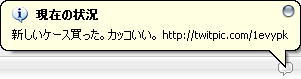

Javaのお勉強の為、Twitterクライアントを作ってみました。  
実家の家族に近況報告が手軽にできればなぁ・・・ということで、  
ただ一人のタイムラインを追うクライアントです。

ツイートはこんな感じでタスクバーからアラート表示されます。  
家族に使ってもらうためだけに作ったので、  
エラー処理とか大丈夫かなという気もするのですが、  
せっかくなので公開します。  
用途が限られてるのでアレですけど、あんまりPCに詳しくない人向けには  
シンプルで良いのかなと思ってます。  
よろしければ使ってみてください。

「あきは元気なの？」  
2012/01/23　追記　Twitterの仕様変更に対応していないので公開停止します。

すみません、変な名前で・・・。  
Javaで作ったのでMacでも大丈夫ではあるのですが、  
確認してみたらUIがすごい崩れてたのでWin専用ということで・・・。
