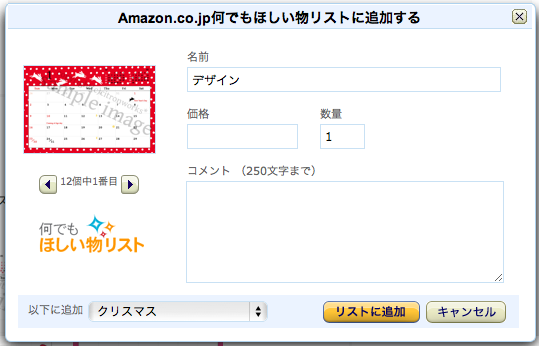

もうすぐクリスマスですね！  
私は一人、家族と離れて生活しているので、  
この時期は通販でプレゼントを探す毎日です。

通販といえばやはりAmazon。とはいっても万能ではありません。  
楽天や個人のネットショップにしかない商品や、Amazonより他の店のほうが安い商品もたくさんあります。

ただ、いろんなお店で目星をつけていると商品の比較がやりにくいし、どの人へのプレゼントを選び終わったのか・・・などを管理しようと考えるとやはりどこかひとつに情報だけはまとめたほうが良い、ということになると思います。

そこで、今回まとめ先に選んだのがAmazonのほしい物リスト。  
これがけっこう便利です。

たぶん前からあった機能だとは思うのですが、Amazonのほしい物リストってAmazonの商品じゃなくても管理できるんですね。  
しかも便利なブックマークレット付き！

例えば・・・  
前回の記事で紹介したcitronworks*さんのカレンダー。これは公式サイトでしか買えません！  
これを誰かにプレゼントしようかな・・・、と思ったらブックマークレット起動。

すると、図のようなダイアログが表示されます。  
ページ内の画像から好きなものを選択して、料金などの情報を入力し、追加しましょう。

Amazonのほしい物リストを表示すると、きちんと追加されていると思います。

ブックマークレットはほしい物リストのページ左下にある「何でもほしい物リストを設定」からインストール出来ますよ。
