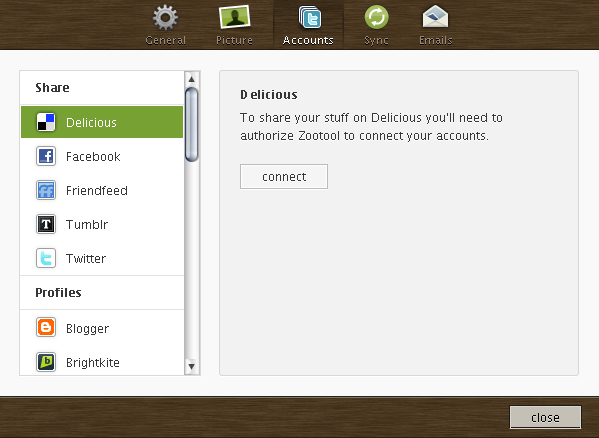

Yahoo!に買収される前からずっとDeliciousを愛用してきた自分にとって、  
Deliciousはなくてはならないサービスでした・・・。  
まさか終了、なんて話になるとは。

今日はDeliciousに代わるサービスってなんだろう・・・とずっと考えていました。

私がブックマークするタイミングは、

・パソコンでだらだらネットサーフィンしてる時  
・ReederでRSS消化してる時

・・・ぐらいなので、Reederが連携対応しているサービスから検討する必要があります。  
（ブックマークレットで追加できることは当たり前として・・・）

ReederではDelicious以外に「[Pinboard][1]」「[Zootool][2]」に対応しています。  
どちらのサイトも見てみたのですが、デザインは圧倒的にZootoolが優れているので、  
こちらに登録してみることにしました。  
（多分Pinboardはデザインで勝負していないだけだと思うけど）

Zootoolは、ページのブックマークだけでなく画像など一部分をシェアすることも出来るみたいですが、  
とりあえずページのブックマーク機能だけお世話になろうと思います。  
Deliciousと同期する機能もあるようなので、  
Deliciousが生きている間はそのままDeliciousを使って、  
終了してしまったらこっちを使うのが良いのかもしれません。

で、肝心のDeliciousからのブックマークインポートですが。  
なんだか混み合っているようで・・・インポートが一向に終わりません！  
進捗も進まない状態・・・。キャンセルも出来ません。  
公式Twitterを見ると、かなり重くなっている、と説明しているので、  
騒ぎが落ち着くまでもうしばらく待つ必要がありそうです。

とかなんとか書いていたらZootool、メンテナンスに入ったみたい？  
デザインは本当に気に入ったので頑張って欲しいところです。  
早く使ってみたい！

 [1]: http://pinboard.in/
 [2]: http://zootool.com/
