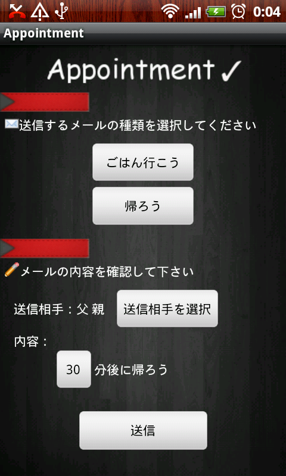

以前、App Inventorで待ち合わせアプリを作りました。

[App InventorでAndroidアプリを作ってみました]()

これを、利用する友人の要望を受けて色々改良してみました。

出来たアプリのスクショがこちら。

目的に応じてボタンで内容を切り替えられるようにしました。

これは単純に、目的毎の内容を囲むArrangementコンポーネントの

表示を切り替えるだけで実現しています。

時間はリストで選べるように変更しました。

設定した時間と相手は、TinyDBを使って保存するようにしました。

再起動すると、前回値が設定されるように実装しました。

単純なアプリですが、この程度ならApp Inventorで作れることがわかったので、

良い勉強になりました。

ただ、出来ないことも色々分かってきました。

送信ボタンは画像を使って目立たせたかったのですが、

デフォルトボタンのようにフォーカスによる変化をうまく実装できなかったのでこれは諦めました。

また、ボタンの背景色をいじったりしていると、実際にデバイスにインストールして確認した時に

うまく描画されていなかったりという不具合っぽいものも・・・。

このへんはもう少し安定するといいですね。

App Inventorで作ったアプリはバーコードで配布することは出来ますが、

現状マーケットで公開することはできないようです。

ちょっと残念ですね。
