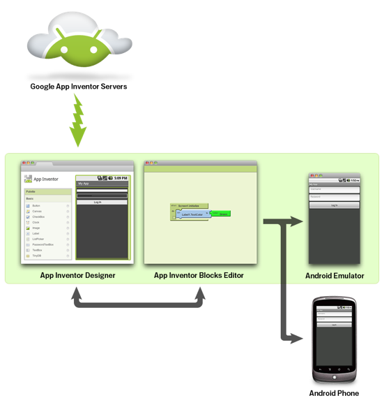
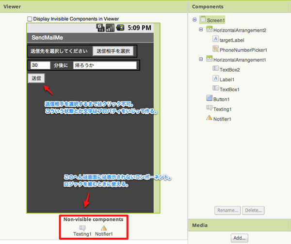
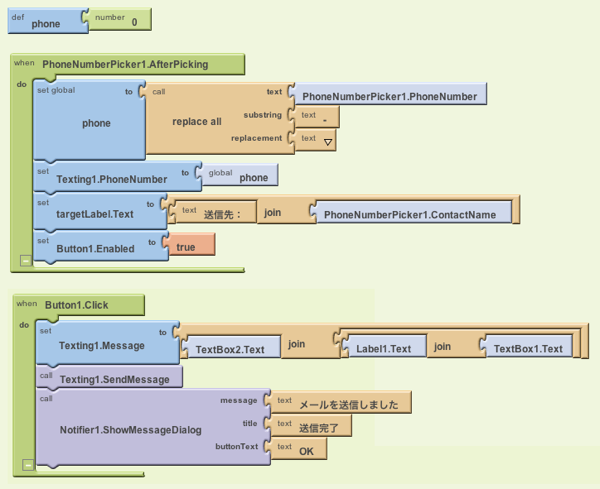

  image by App Inventor

App Inventorとは、GUIでAndroidアプリを作れるツールです。

ドラッグ＆ドロップでコンポーネントを配置し、

パズルのピースのようなものを組み合わせることでコーディングすることなく、

アプリを開発することができます。

興味があったのでちょっとやってみました。

<!--more-->

## 環境構築

[公式サイト][1]の「Get Started」から手順を追って進めます。

デザインツールはブラウザ上で動作しますが、ロジックツールはインストールする必要があります。

Javaのインストールを忘れずに。

チュートリアルもついでに行えば一応ツールの使い方はひと通り分かると思います。

開発したアプリはエミュレータでも実機でも確認できます。

以前Java＋Eclipseで開発したときは、エミュレータに反映させるのにすごく時間がかかりましたが、

App Inventorはわりとすぐに反映されます。感動！

## 作るものを決めよう

今回作ったアプリは、Javaで作ろうかなーと思っていたメール送信アプリです。

指定した相手に、ちょっとだけ編集できるメッセージでメールを送信する超単純アプリ。

何故こんなアプリを作ったかというと、いつも一緒に帰る相手に帰れそうな頃連絡してもらうのですが、

毎回ほとんど同じ文言のメールを送信するのが面倒、と言われていたので、

じゃあ定型文送信アプリみたいなものがあればいいよね、と話していたのです。

App Inventorが用意しているコンポーネントでなんとかできそうだったのでやってみました。

ちなみに、現状なんでもかんでもこのツールで作れるわけではないので、

一度使えるコンポーネントを確認してから設計したほうがいいと思います。

## 画面を作ろう

環境構築が完了していれば、<http://appinventor.googlelabs.com>にアクセスすることで、

デザインツールを表示することができます。

ひどいデザインですが、今回はあんまりこだわらずに単純に作りました・・・。

メール送信は「Texting」を使って行います。

送信先の指定はテキストボックスで入力させてもいいのですが、今回はピッカーを使ってみました。

実際には私が欲しいアプリは送信先固定でいいぐらいなので、

DBを使って記憶させたほうがいいのかも。でも、今回は使ってません。

また、ピッカーで選択するまでは、送信ボタンはクリックできないようにしました。

ちなみに、ボタンを画像にする・・・とかはプロパティをいじるだけで簡単にできます。

## ロジック部分を作ろう

デザインツール右上のボタンからロジックツール、「Blocks Editor」をクリック。

すると、JNLPファイルがDLされるので実行してください。これで起動できます。

左側のエリアに、条件式や変数を作るブロックや、先ほど作った画面で使っているコンポーネントに対して

使えるブロックが並ぶので、これらを組み合わせてプログラムを作ります。

これが今回のアプリの全てです。恥ずかしいけど公開しちゃいます。

始めて作ったのでかなり不恰好かつ不必要な処理が入っていますが、

実機でもテストしてみたところ、まあ一応これで目的は達成できました。

ちょっとつまったところは、ピッカーでとれる電話番号はハイフン付きなのですが、

Textingに指定すべき電話番号はハイフンなしであること。

ハイフン付きがとれてる、とかアラートでテスト表示させてみるまで気づきませんでしたよ・・・。

replace allでハイフン削ってセットさせました。

## 公開してみよう

デザインツール右上の「Package for Phone」からDLできます。

バーコードの表示などもできるので公開も簡単ですよ。

## 使ってみた感想

デザインはやっぱり楽ですね。

なんでもかんでも出来るわけではありませんが、これぐらい単純なアプリならすぐ出来ます。

後はどれだけきれいなデザインにできるか・・・かなぁ。

ロジックのところは、用意されている処理の意味を把握しておく必要があるので、

プログラミングを全くやったことがない人には簡単簡単！というわけにはいかないかも。

でも慣れれば楽ちんです。この程度のアプリなら３０分もかかりません。

あと、パズルがカチッとはまる音が地味に楽しいですね。

今回、以下のサイトを大いに参考にさせていただきました。

[ソフトウェア技術ドキュメントを勝手に翻訳][2]

公式のリファレンスとかを訳してくださっています。

チュートリアルについては、公式のものはもちろん、[Community Tutorials][3]もおすすめ。

リファレンスだけ見て、たいしたことできないじゃん・・・と思っていても、

検索してみるとけっこうすごいことをしてる方がいっぱい・・・。

奥が深いですね。

開発の選択肢が増えたので、目的に応じて使い分けていきたいと思います。

 [1]: http://appinventor.googlelabs.com/about/
 [2]: https://sites.google.com/a/techdoctranslator.com/jp/home
 [3]: https://sites.google.com/site/appinventorresources/home/tutorial-topics
