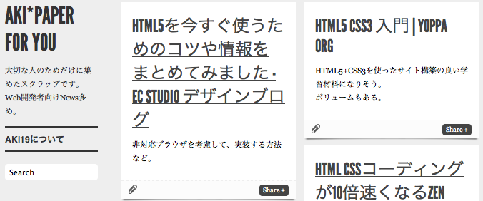

恥ずかしながら「キュレーション」という言葉を最近知りました。

もともとは美術館などで作品を選別する（？）ことらしいですが、

昨今のネット社会ではこれに「情報の」という言葉をつけて、

ネットの情報を収集・選別・意味付けして共有すること、という意味で使っているらしいですね。

そこで今回は「大切な人のために」キュレーターになってみようと思い、

選別・情報共有する流れを作ってみたのでメモしようと思います。

そもそもの始まり。

毎日私は、そこそこな量のRSSを購読して、情報収集しています。

そしてこの行為がけっこう好きです。大事な時間です。

でもあんまりアウトプットにはつながっていません。

自分の興味が今の仕事と若干離れているので、うまく活かせていません。

一方私の大切な人は、RSSを購読はしていますが、私から見ると情報が偏りがち。

かつあんまりマメにチェックしていないので、すぐ未読がたまり、

見きれなくて一気に既読にしていることがよくあります。

今まではこれでも別に良かったのですが、彼の仕事内容が変わり・・・

ちょうど自分の興味＝彼の仕事、という状態に。

私の好きな分野であるということは彼も知っていたので色々頼ってくれることに。

そこで、私としても彼のために何かできないかな・・・と考え、

彼のためだけのスクラップサイトを作ってみようかなと思いました。

土台として選んだのはTumblr。

Posterousともかなり迷いましたが・・・

・Tumblrのほうがブックマークレットが優秀であること

・記事タイトルクリックで元サイトに飛べること

上記の理由からTumblrを選択しました。

（Posterousの、更新を日刊や週刊でメール配信してくれる機能には未だに惹かれていますが）

私はもともとTumblrサイトを持っていたので、今回は２つめのサイト。

作成方法は、ダッシュボードの右サイドバーから「Create a new blog」を選択して行います。

サイトができたら収集。

ポストするときはなるべく「何故、このサイトをおすすめしたいのか」などの一言コメントを

そえようと頑張っています。

更新通知は今回「[MAILPIA][1]」を使うことにしました。

RSSを購読してもらうだけでは結局埋もれてしまうので・・・。

配信をメール通知すれば読んでくれるはず・・・。

これ別にキュレーションでもなんでもないかもしれませんが、気にしないことにします。

彼が読んでくれなくても自分の興味が集まったサイトでもあるので、自己満足でいいかな。

まとめてみるとなんてことない話なのですが、はじめはPosterousの配信機能がどうしても使いたくて、

でもサイト自体はTumblrでちゃんと持ちたくて、

PosterousからTumblrにオートポストしてみたり、色々ごちゃごちゃしていました。

ですが、結果的にPosterousのブックマークレットがシンプルすぎて諦めました。

メール配信も週刊にしたくてMy RSSを使ってみたり、でもこれが生成するRSSが微妙で諦めたり・・・と

一週間ぐらいどたばたしてようやくブログ更新できる状態に。

役に立つサイトになればいいのですが・・・。

 [1]: http://www.mailpia.jp/service/personal/top.html
