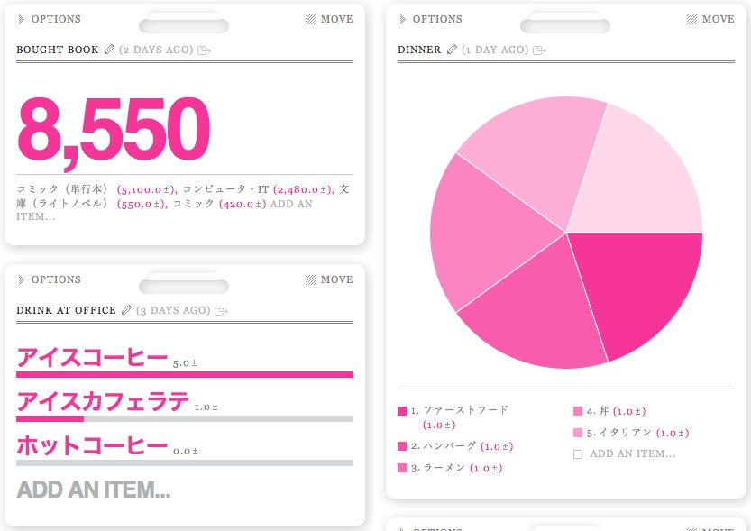

好きなことを数で記録出来、これをきれいにグラフ等で表示してくれるWebサービス、  
[Daytum][1]がiPhoneアプリをリリースしたことにより、  
ライフハッカーを中心に再注目を浴びているようです。

  <a rel="nofollow" href="http://itunes.apple.com/jp/app/daytum/id352646537?mt=8&#038;uo=4&#038;at=11l9Ag" target="_blank"><strong>Daytum 1.0.2 for iPhone</strong></a>  カテゴリ: ライフスタイル 価格: 無料  更新: 2010/12/31 

私自身はおそらくLifehacking.jpが一番最初に紹介した時に始めたと記憶していますが、  
肝心のデータの追加方法が面倒で、ほどなくやめてしまいました。  
が、この度iPhoneアプリが出てくれたおかげでデータ追加がだいぶ楽になり、  
再チャレンジすることにしました。

Daytumで何を記録するか・・・けっこう悩みましたが、  
現時点での私なりの活用方法をメモしておこうと思います。

私がDaytumで記録していることは以下の通りです。  
CATEGORIES（ITEM：AMOUNT）

・買ったアプリ（iTunesカテゴリ：金額）  
例：仕事効率化、ゲーム  
・買った本（ジャンル：金額）  
例：コミック、コンピュータ・IT  
・ネットで買った（ジャンル：金額）  
例：洋服、フィギュア  
・ディナー（種類：回数）  
例：イタリアン、ファーストフード  
・職場で飲んだ（種類：回数）  
例：アイスコーヒー、ホットコーヒー  
・アルコール（種類：回数）  
例：チューハイ、ワイン

一応これらを記録することには意味があります。

金額を対象にしているものは、支出の見直しに使う予定のものです。  
今までもiPhoneアプリで支出管理はしていたのですが、  
結局記録するばかりでちゃんと見直しできていませんでした。  
原因はたぶん色々あるとおもうのですが、  
登録するときのカテゴリーが多すぎること＆固定費もいっしょくたに登録していること、  
が主な要因だと感じています。  
そこで、Daytumでカテゴリーとしてフューチャーさせることで、  
使い過ぎをよりはっきりと可視化できるのでは・・・と思い、始めています。

また、クレジットで買ったものは、購入した日よりもかなり後に請求がきます。  
この時たいてい店名ぐらいしか情報がなく、  
何をこんなに買ったんだか・・・という感じでした。  
これも見直せるはず！

一方回数を対象にしているものは、生活の見直しに使う予定のものです。  
ディナーは基本外食なのですが、  
今週はファーストフード多すぎだから今日は和食にしよう、とか  
最近自炊してないから今日はしよう、とか・・・。  
（まあメイン目的はあわよくばファーストフードに行こうとする恋人を説得するためです・・・。）

他は、職場でコーヒー飲み過ぎ＆家でアルコール飲み過ぎなので、  
回数をカウントしてセーブしよう、とか。

なんでもかんでも記録、というのは面倒臭がりな私には続かないと思ったので、  
私にとって価値のありそうなことを記録してみています。  
半年ぐらい続けばデータとして素敵なことになりそう。

DaytumはWebの使い方がちょっと分かりにくく、始めた当初はものすごく苦労したのですが、  
Lifehacking.jpで堀さんがすごく分かりやすいビデオを用意してくれています。  
始めての方は是非そちらを御覧ください。

  <strong><a rel="nofollow" href="http://lifehacking.jp/2011/01/daytum-in-10minutes/" target="_blank">10分でわかるライフログサービス Daytum の使い方 | Lifehacking.jp</a></strong><strong></strong>

ヘビーに使っていると、iPhoneアプリの不具合（時々データ重複が起きたり・・・）が  
けっこうきついので、早く直るといいな。

 [1]: http://daytum.com/
