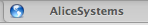

Egretlinksは、EvernoteのURLが設定されているノートのみを表示するiPhoneアプリです。

私は普段からWebクリップしたノートについては必ずURLを設定していたので、

このアプリとはけっこう相性が良く、楽しく使っています。

 <a rel="nofollow" href="http://itunes.apple.com/jp/app/egretlinks/id417348812?mt=8&#038;uo=4&#038;at=11l9Ag" target="_blank"><strong>Egretlinks 1.1</strong></a>  
カテゴリ: 仕事効率化 価格: ￥450  
更新: 2011/02/08 

Egretlinksのメイン画面は、上図のようにノートを並べますが、

この時各項目の左側にはFaviconが表示されます。

アプリ内でページを開くとFaviconが表示されるようになるのですが、

AliceSystemsの場合、どうにもつまらないノートのアイコンが表示されてしまっています。

（このアイコンはモバイル用に最適化してくれるWPtouchプラグインのデフォルトアイコンです。）

これでは寂しいので、今回は自分の好きなFaviconを設定してみようと思います。

<!--more-->

AliceSystemsはWordPressブログなので、以下の内容はWordPressの場合の話。

## Faviconを設定する（モバイル表示用）

WPtouchプラグインを使っているので、プラグインの設定画面から設定します。

まずは、下のほうにある「Default & Custom Icon Pool」でアイコンをアップロードします。

色々とステキなアイコンを用意してくれているのでこの中から選んでもいいのですが、

今回は自分で用意したアイコンを使います。

アイコンはTwitterアイコンとしても使っているキノコさんを使うことにしました。

[Upload Icon]からpngかjpegかgifファイルを指定。

通常Faviconで利用するicoファイルはダメです。

アップロードが成功すると上図のように画像が追加されます。

続いて、これをFaviconとして設定します。

この下にある「Logo Icon // Menu Items & Pages Icons」で、自分のアイコンを選択します。

一度ページを更新しないと追加したアイコンが選択肢に表示されないので注意してください。

アイコンを選択したら設定を保存。

Egretlinksで確認してみましょう。

ノートアイコンが自分の設定したアイコンに変わりました！

## Faviconを設定する（PC表示用）

Egretlinksで見る分にはこれで十分なのですが、ついでにPC用にも設定しておくことにします。

ちなみに、Faviconが設定されていないサイトをSafariで見ると、

下図のようなアイコンが表示されているはずです。

PC用にはico形式のアイコンが必要なので、まずはこれを作ります。

Favicon作成サービスは色々ありますが、今回は下記のサイトを利用しました。

<a rel="nofollow" href="http://ico.bradleygill.com/index.php" target="_blank">Bradicon! &#8211; converting icons since&#8230; well, a little while now</a>

[Browse]からアイコンを指定してアップロードするだけで、

Faviconに使えるicoファイルがダウンロードできるようになります。

続いて、作成したicoファイルを使っているテーマフォルダ直下にアップロードします。

AliceSystemsの場合は、monochromeテーマを使っているので、

アップロード先は「/wp-content/themas/monochrome」になります。

アップロードするファイルの名前は「favicon」にしてください。

最後に、テーマのヘッダーファイル（header.php）のhead要素内に以下のコードを入力。

<pre class="brush:php">&lt;link rel="shortcut icon" href="&lt;?php bloginfo('template_directory'); ?&gt;/favicon.ico" /&gt;</pre>

ファイルを更新してサイトを更新すると・・・

アイコンが自分の設定したアイコンに変わりました！

Faviconを設定しておくと、Egretlinksで視認性が上がるので良いですね。

色々なアイコンが並んでいると楽しいですし。

今回は適当に用意したアイコンを利用しましたが、

時間のあるときにもうちょっとこだわって用意してみようかなと思います。
