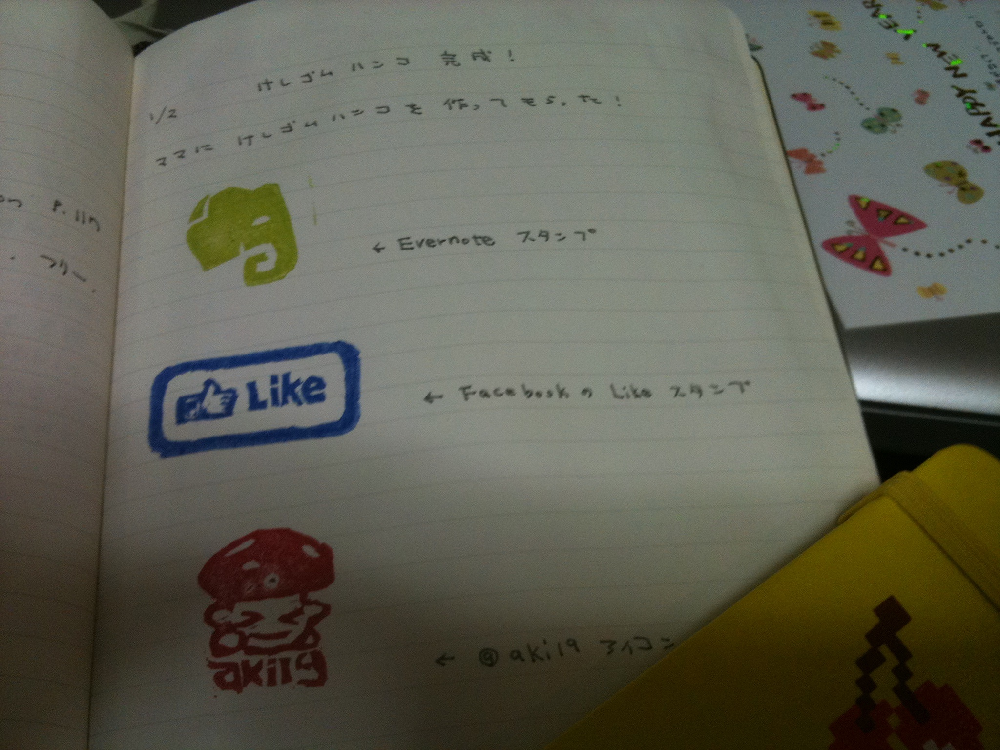
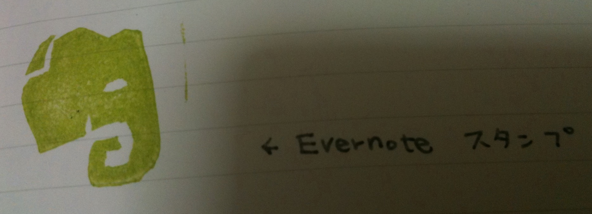
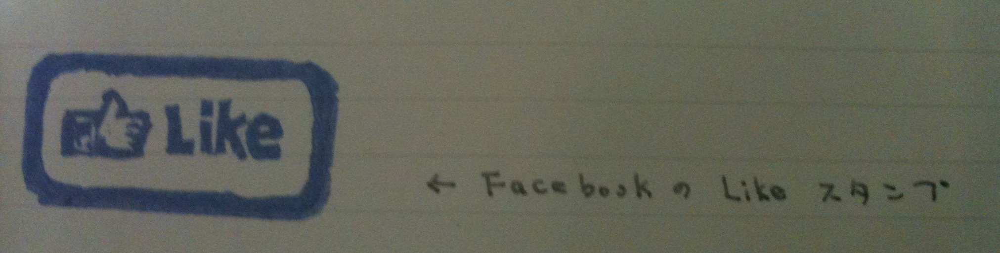
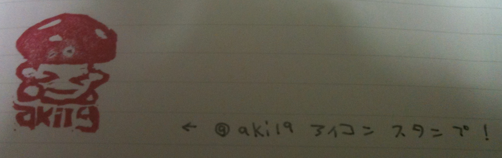

帰省中、手先の器用な母親にお願いして消しゴムはんこを作ってもらいました！

もともと[こちらの記事][1]を見て、いいなぁ・・・と思っていたのですが、業者に頼むのはちょっと高すぎると思い・・・  
そういえば親はよく年賀状用にはんこ作ってるよなーだったら親にお願いすればいいじゃん！・・・と。  
ささっと作ってくれました。  
素朴な感じが気に入っています。

Evernoteスタンプ。  
象ならもっとかわいいデザインにしなさいよ、何よこれ。と散々言われつつ（笑）  
モレスキンに書いたことをEvernoteにコピーした時などに使うつもりです。

FacebookのLikeスタンプ。  
これは色々使えそう。

そしてそして・・・ @aki19 アイコンスタンプ！  
すごい！感動！かわいい！  
私のスタンプの押し方がヘタですが、よく再現できているのではないでしょうか！  
使い道は今のところ思いつきませんが、オフ会とかにいいのでは。  
（金の匂いがする・・・！）

親もちょっとこの作業が楽しくなっちゃったみたいで、  
pickのアイコンとか色々頼んで帰りました。  
お手製のはんこでモレスキンを飾れるなんて嬉しいな。

モレスキン裏表紙には [@OZPA][2] さんの[年間カレンダー][3]。  
月の移り変わりには[ウェブスタジオ　アラクネ][4]さんの[月間カレンダー][5]の縮小版。  
そして色々買ったり作ってもらったスタンプで、  
2011年は手帳なしモレスキン一本生活を始めてみようと思います。

 [1]: http://ooze-flash.com/2010/11/evernote-stamp-for-moleskine.html
 [2]: http://twitter.com/OZPA
 [3]: http://ozpa-h4.com/2010/11/10/moleskinecal/
 [4]: http://www.arachne.jp/
 [5]: http://www.arachne.jp/calendar/
