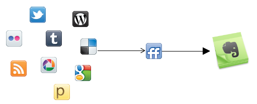
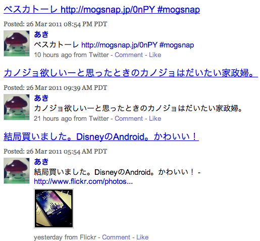

もうずいぶん前から色々な方がされている方法ですが・・・  
たくさんのサービスを[FriendFeed][1]に集約させて、Evernoteにログを残すことにしました。

もともとTwitterのログやチェックイン履歴などは、  
iPhoneアプリのMomentoから確認すればいいや、とEvernoteに残すことはしていませんでした。  
ですが・・・まぁ見ない見ない。  
Momentoはきれいに情報をまとめてくれますが、これを使って過去を見返す機会はなかなか訪れず・・・。  
それならこういったログはEvernoteに残したほうが、やっぱりいいのかなと思い立ち、  
Evernoteにもまとめようと色々設定してみました。

私は、Twitterの他にもDeliciousにブクマしたこととかFlickrにアップしたこととかも、  
一緒にとっておきたかったので、FriendFeedでまとめてからFeedBurnerを使って、  
一日のログをEvernoteのメルアドに送る、というよくある方法をとりました。  
FeedBurnerではメールのフォーマットを決められるので、  
指定したノートブックに自動的に入れることができます。  
これで意識せずにどんどんノートをためることができます。

また、最近同行している人のプライバシーを尊重し、  
チェックインをTwitterのメインアカウントに流すのをやめました。  
こっちは非公開のサブアカウントに流す設定にしています。  
これに関してはEvernoteに保存するのはとりあえずやめています・・・。

Evernoteにはこんな感じでログがたまります。  

]

あんまり美しくはないですが、とりあえず必要十分。

残すログについてはまだ迷っているのでごちゃごちゃいじる予定ですが、  
一応満足に動いています。

 [1]: http://friendfeed.com/
