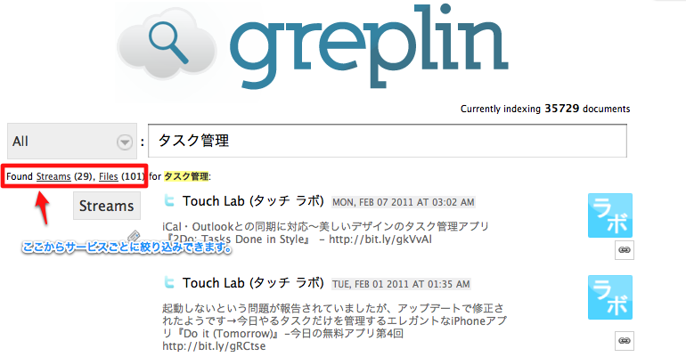

以前紹介したクラウド検索サービス「Greplin」がバージョンアップしてベータをはずれました。

[クラウドデータ検索サービス「Greplin」がEvernote対応した！]()

日本語検索もオッケーになったみたいです。

冒頭の画像は「タスク管理」で検索してみた場合。  
下のほうに結果がずらっと並びます。  
Evernoteに貯めていた情報もきちんとヒットしていました。

対応しているサービスは下図のとおり。

星印はプレミアムアカウント限定です。  
フリーでもDropboxはいけますが、Evernoteはダメですね・・・。

なんと今回ベータテスターは自動的にプレミアムアカウントにアップグレードされました！  
メールに、「that&#8217;s you!」とあってドキッとしてしまいました。  
こういうサービスは嬉しいですね。
