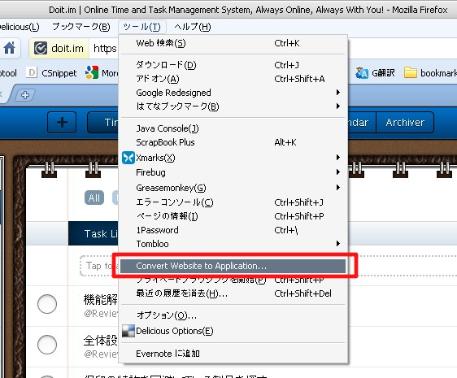
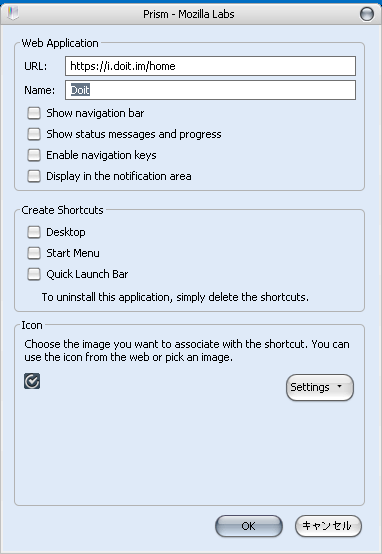
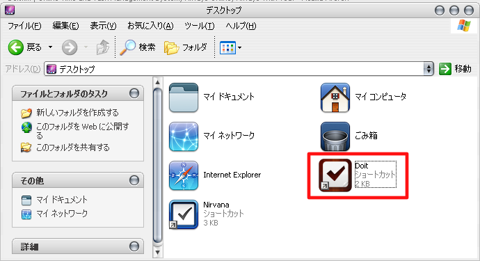
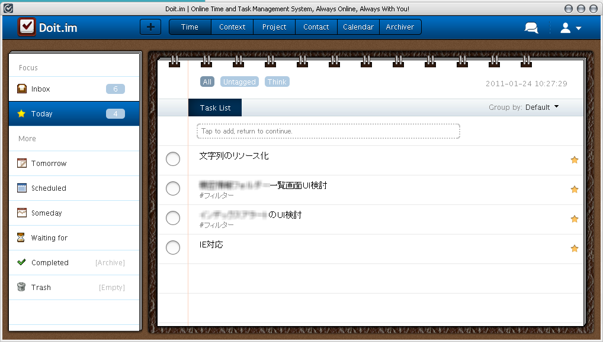

前回の「[私とGTD：会社編②ツール選び]()」で比較した中に「Doit.im」というソフトがありました。  
これは、デスクトップ版よりWeb版のほうが機能的にも上で、動作も安定しています。  
なのでWeb版を使うことをおすすめしますが、私自身はデスクトップアプリで良いGTDツールはないかな、と探していたので使用にちょっと躊躇しました。

そもそも私がデスクトップアプリにこだわって探していた理由は、  
Firefoxがメモリをくいまくるのであんまりブラウザを使いたくなかったこと、  
ドラッグ＆ドロップで操作したかったこと、などが挙げられます。  
D&Dによる操作は、たいてい最近のサービスは実装されているのであまり気にしなくてよいことがわかりました。  
Firefox云々・・・の部分は、Prismを使ってアプリ化することで対応できそうな気がしたので試してみることにしました。

Prismとは、指定したサイトをデスクトップアプリのように使えるソフトです。  
アプリ化して起動すると、ツールバーなどをそぎ落としたシンプルなブラウザが立ち上がります。  
アドオンなどが読み込まれないのでメモリもそんなにくいませんし、起動もそこまで遅くありません。

以下は、Prismを使ってWebサービス（Doit.im）をアプリ化する手順を示します。

<!--more-->

私は仕事上Firefoxをメインにせざるを得ないのでPrismを使いましたが、  
Chromeであればブラウザの機能として簡単にWebアプリ化できるので楽ですよ－。

**インストール**  
Prismにはアドオン版とスタンドアローン版があります。  
アドオン：<https://addons.mozilla.org/en-US/firefox/addon/mozilla-labs-prism/>  
スタンドアローン：<https://wiki.mozilla.org/Prism>  
今回は、アドオン版を使ってみます。  
上述したアドオンサイトにアクセスして、Firefoxにインストールしてください。  
再起動したら準備OK。

**アプリ化する**  
アプリ化したいサイトにアクセスします。  
メニューのツールから[Convert Website to Application&#8230;]を選択。

すると次のようなダイアログが表示されます。

ダイアログではナビゲーションバー（前へ進むとかホームボタンとか）を表示するか否かなどを設定できます。  
アイコンはデフォルトでfaviconを拡大したものが設定されてしまうので、何か適当に用意した方がかっこいいです。

図は、デスクトップにショートカットを作成した場合。

**使ってみよう**  
作成されたショートカットを起動すると、設定した内容のアプリが起動します。

アンインストールはショートカットを削除するだけです。

如何だったでしょうか。  
アプリ化したいサイトのみならずよく使うサイトのショートカットを作っておくとけっこう便利かも知れません。  
これならデスクトップアプリにこだわらずにすみそうなので、もう少しGTDツール、探してみようかなと思います。
