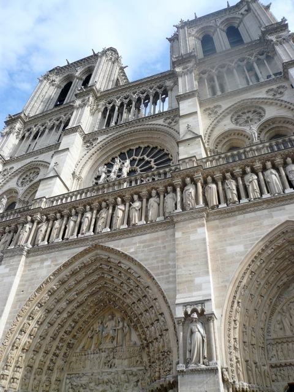

新婚旅行に行ってきました。  
場所は私の希望でドイツ、夫の希望でスイス、ツアーについていたのでフランス。8日間の旅でした。

事前にもらったツアーガイドやガイドブックで予習し、以前買っていたパックマンの小さなモレスキンに書き込んで、これをお供に。  
旅の日記や気になったことなども全てこのモレスキンに書き込んでいったのでなかなか良い思い出の品になったのではと思っています。

私はあまり感情豊かな人間ではないのですが、念願のノイシュバンシュタイン城を橋から見た時は思わずため息が出るほどでした。  
真っ白なお城をイメージしていたのですが、実際に見るとちょっと灰色が入ったなんともいえない美しさ。  
もちろんGowallaでチェックインしました！

その他にも世界一高い所にある駅、ユングフラウヨッホから見た氷河の美しさ、モンサンミッシェルから見た果てしない陸、海、空。ノートルダム大聖堂の細かい装飾…。  
素晴らしい、美しいとしか言葉が出ませんでした。

ツアーはけっこうハードスケジュールでしたが、その分たくさんの場所をまわることができましたし、団体なので予約が出来、長い行列を回避することもできたので良かったかなと思います。  
特に添乗員さんがベテランの方で、色々とお話ししてくださったので、観光地のこと、現地の人の考え方、日本との違いなど様々なことを知ることができました。特に細かいマナーなどは日本では考えられないことも多かったので知らないで行っていたら色々失礼にあたる行動をとっていたかも。

特に驚いたのが運転手の国籍によって休憩時間が違うこと。  
まさか海外旅行で労働基準法という言葉を聞くことになるとは思いませんでしたが、何時間運転したら翌日は何時までエンジンかけられない、とか運転手がフランス人の時は途中の休憩時間は最低30分取らないといけない、とか。  
最近は車自体がこのルールに従って制御されているそうです。  
さすが労働者が強い国…有休が5週間ある国は違いますね。

最後の日はパリで一日フリーの時間を過ごしました。  
自分たちだけでタクシーに乗ったりメトロに乗ったり。  
すごく貴重な体験をしました。  
気づいたこと色々。

・フランス人もエスカレーターでは左を空ける。どんなに右ばかり混んでいても空ける。  
・携帯電話でゲームしている人多し。ただしiPhoneが多い印象は受けなかった。BlackBerry強し。  
・いたるところにSAMSUNGの広告。  
・一番右の道路はバスやタクシー専用。なのでバスは時間通りにくると思われる。タクシーは安いしメトロより安全。  
・メトロの路線はたくさんあれど一律料金なので日本より分かりやすい。電車はすぐくる。ドアは自分で開ける。  
・何をするにもまずは挨拶。観光地は英語が分かれば充分。ツアーなら日本語でも大丈夫。パリはフランス語オンリーの場所もたくさん。フランス語は文字から推測できる、というものでもないし発音も難しいのでコミュニケーションが大変。若い人は英語も多少出来るらしい。  
・ルーヴルの有名なピラミッドの真ん前にApple Storeが！  
・ルーヴルは広すぎて死ぬ。休んでいる人たくさん。二時間いたけど本当にちょこっとしか見れなかった。

帰宅してからは写真をまとめたりTriplineに記録したり。デジタルのまとめはようやく落ち着いてきました。  
あとはアナログ。チケットやパンフレットをまとめる作業が…。

結婚休暇で長くお休みいただいていましたが、来月からお仕事再開です。  
お金を貯めてまた行きたいな。
