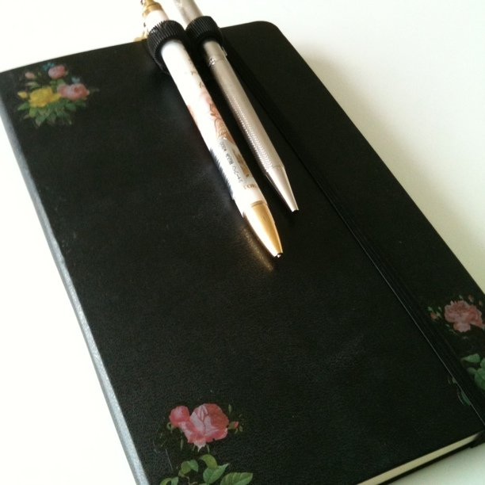

そろそろ初めてのモレスキンが書き終わりを迎えるので、未来の自分のために、一冊目に書いたことやどう使ったかをまとめてみたいと思います。

<!--more-->

まずはデータ的なこと。

タイプ：ルールド・ラージ  
書き始め：2010.09.25  
書き終わり：2011.05.31（予定）

今年は手帳を持たずにアナログ的なものはモレスキン一本でいこうと考えていたので、普通のモレスキンを手帳として使うために以下のようなことをしてみました。

・表紙裏に年間カレンダー（<a target="_blank"  href="http://ozpa-h4.com/2010/11/10/moleskinecal/">OZPAさん作</a>）  
・毎月はじめに左ページに月間カレンダー（<a target="_blank" href="http://diynote.jp/refill/detail/6/">フリーテンプレートを利用</a>）。右ページにその月の仕事やプライベートの主な予定、目標。  
・毎月はじめのページをすぐに探すための索引（実際には月間カレンダーを貼ったときにページが厚くなったため索引としてはあまり使わず）

また、モレスキンを使い始めた頃、ちょうどモレスキン本が発売したのでこれの影響をけっこう受けました。

<iframe style="width:120px;height:240px;" marginwidth="0" marginheight="0" scrolling="no" frameborder="0" src="https://rcm-fe.amazon-adsystem.com/e/cm?ref=tf_til&t=check-22&m=amazon&o=9&p=8&l=as1&IS1=1&detail=1&asins=4478013268&linkId=de983d719c0b4bed9607a5add48ebfa6&bc1=000000&lt1=_blank&fc1=333333&lc1=0066c0&bg1=ffffff&f=ifr">
    </iframe>

  具体的には・・・

  ・左ページにページ番号をつける  ・スレッドページを用意する  ・TODOが発生したときはチェックボックスをつける  ・内容が続く場合はリンクする

  私の場合、TODOはToodledoで管理しているので、（デジタル環境がないところで）TODO発生→モレスキンに記録→Toodoledoにタスク追加→モレスキンのチェックオフという流れで利用しました。

  予定の記録の他には、以下のようなことを書きました。

  ・仕事で使うモックアップや会議のメモ  ・アプリの企画とか  ・特別な日（旅行とか）の記録  ・私や彼が疑問に思ったこと＆調べた結果  ・ブログの下書きの下書き

  上のいくつかは清書して他のデータと関連づけてEvernoteにも記録しています。

  スレッドページには以下の内容を用意しました。

  ・調べ学習ページへの索引  ・旅行記への索引  ・月はじめのページへの索引＆その月のまとめ（月が終わったときにスレッドページに追記してその月にあった主なことを一緒にメモしておきました）  ・プロジェクトに関する会議メモページへの索引

  使い始めはすでにデジタルでいろいろ管理していたので、うまく使いこなせるか不安でしたが、モレ本のおかげでそこそこ活用できた気がしています。  ただ、反省点もいろいろあります・・・。

  ・スタンプをあまり使わなかった  スタンプは持ち歩けないので週次レビューでカテゴリーごとにスタンプを押すつもりでしたが、レビューをあまりやらなかったので結局ほとんど使わず・・・。  視認性が悪くなってしまいました。  かわいいインクとかスタンプをいろいろ用意してはいたのですが、掃除とか考えるとやっぱりスタンプって面倒くさい・・・。（インクがセットになってるやつなら大丈夫だろうけど）  割り切って大きめのシールで代用するか、きちんとレビューを組み込むか考えないといけなさそうです。

  ・デジタルとアナログの使い分け  いいのか悪いのかわかりませんが、データが重複したり、「この内容はどっちに書こうかな」という無駄に逡巡してしまったかも。  私はもともとWebサービスが好きで、いろいろ使っているのでなおさら困りました・・・。  これに関してはどうしたらいいのか未だに悩んでいます。  「カレンダーにシールを貼る」という行為が自分にとっては大事なので、手帳は絶対必要。これだけははっきりしているのですが、そのほかの内容についてはなかなか難しいですね。

  ・ペンの管理  消せるボールペンが気に入ったのでペン自体は決まったのですが、これをノートにくっつけるアイテムには最後まで悩みました。（今も・・・）  最初使ってたやつはクリップタイプだったのですが、ノートを傷めてしまって。  今は何も使わずにペンのクリップではさんでいますが、クリップ自体が壊れ気味になってきました・・・。  最近以下の商品を知ったので検討中です。

  <a rel="nofollow" target="_blank" href="http://www.quiverglobal.com/">Quiver pen holders for your treasured notebooks</a>

  まだまだ使い方は揺れていますが一冊目はこんな感じでした。  次のモレスキンはすでに購入済み。  星の王子さまルールド・ラージです！楽しみ。

  あと、モレ本2冊目が出るらしいですね。  こっちもとても楽しみです。

