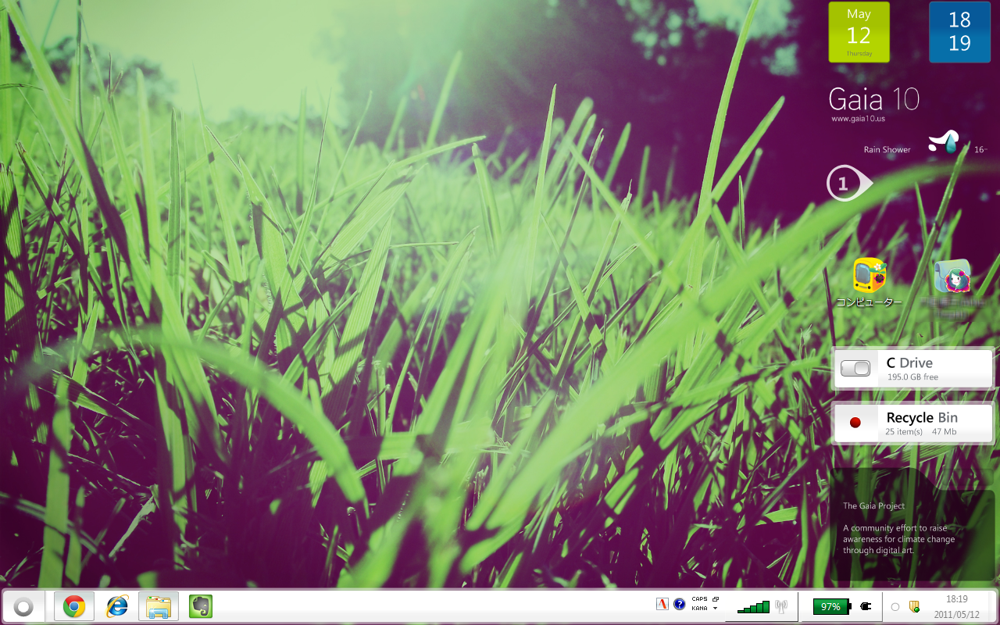
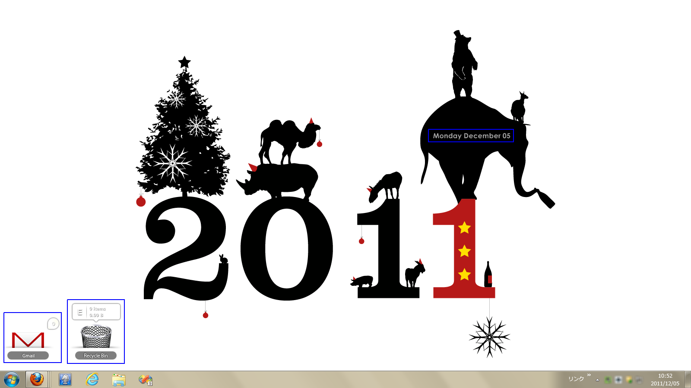
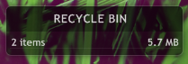
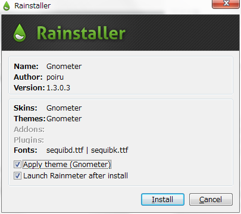
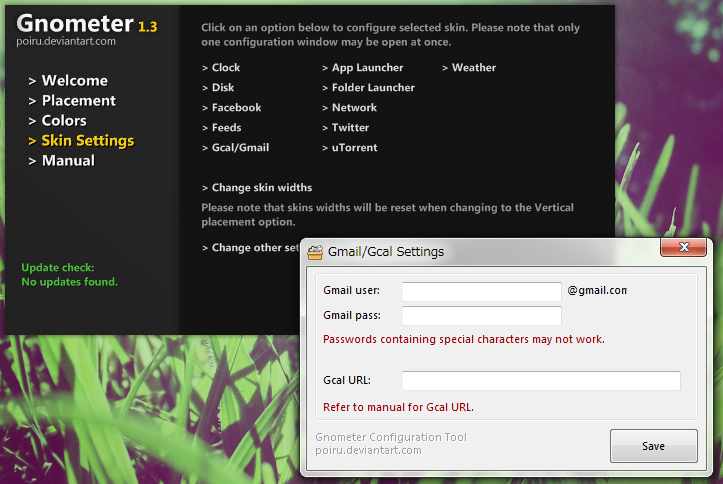

賛否両論？のライフハッカーですが、「素敵なデスクトップを探して」シリーズは大好きです。  
Windows,Mac,Androidなどの素敵にカスタマイズされたデスクトップとその構築方法を紹介する短い記事で、毎月デスクトップを変えている私は大いに参考にさせてもらっています。

その記事の最後に、必ずといっていいほどRainmeterをおすすめする一文が入っていて、  
金でももらってるんじゃねーかというレベルなんですけど、  
確かに便利なWindowsソフトなので今日はそれをご紹介したいと思います。  
デスクトップカスタマイズは言い尽くされた感のある古い話題かもしれませんが、  
どうかおつきあいください。

<!--more-->

■Rainmeterとは？

一言で言えばデスクトップカスタマイズソフト。  
だいぶ昔からあるソフトですが、今でも精力的にバージョンアップを続けています。  
デスクトップに様々な機能を有するスキンを貼り付けることができて、  
定番の時計やカレンダーの他、RSSリーダーやメールチェッカーなどもあります。  
スキンは、仕様が公開されているので頑張れば誰でも作れます。  
とにかくスキンありきのソフトなので、以下に挙げるスクリーンショットを見て  
ちょっとでも「いいな」と思ったら是非試してみてください。

  
[Eker_lina rainmeter The SKIN][1] by ~[hpluslabels][2]{.u} on [deviantART][3]  
  
[Newspaper Desktop][4] by ~[Tatenokai][5]{.u} on [deviantART][3]  
  
[iSteve][6] by ~[minhtrimatrix][7]{.u} on [deviantART][3]

ついでに今現在の私のデスクトップ。

青枠で囲った部分がRainmeterスキンです。

インストールは以下からどうぞ。

<a href="http://rainmeter.net/cms/" target="_blank">http://rainmeter.net/cms/</a>

■スキンを貼ってみよう

では、実際にデスクトップを便利にしてみます。  
私が特にお気に入りのゴミ箱スキンとGmailチェッカースキンを配置してみます。

□準備  
Rainmeterのインストールはできましたか？  
起動すると、デフォルトのスキンがたくさん配置されていると思います。  
不要なスキンは閉じてしまってください。  
スキンの上で右クリック→「Unload Skin」で閉じれます。

□ゴミ箱  
デフォルトのスキンパックであるillustroにあるのでそれをそのまま使ってみましょう。  
初回起動時にはすでに配置されていると思いますが、閉じてしまった場合・・・  
タスクバーのRainmeterアイコンを右クリックでメニューが開くので、  
「Skins」→「illustro」→「Recycle Bin」→「Recycle Bin.ini」を選択します。  
これでデスクトップのどこかにスキンが配置されるので、ドラッグして好きなところに再配置してください。

このスキンの便利なところはなんといってもここから直接ゴミ箱を空にできるところ！  
「RECYCLE BIN」の文字の上で右クリックを押してみてください。  
本当に空にしていいかどうかを確認するメッセージボックスが表示されると思います。  
ちなみに、左クリックした場合はゴミ箱が開きます。

□Gmailチェッカー  
このスキンはillustroにはないので追加でインストールする必要があります。  
色々ありますが、今回は公式で配布されているスキンパックGnometerのスキンを使ってみましょう。  
以下からGnometerをダウンロードしてください。（拡張子はrmskin）

<a href="http://rainmeter.net/cms/SuitesGnometer" target="_blank">http://rainmeter.net/cms/SuitesGnometer</a>

ダウンロードしたRainmeter Skin fileをダブルクリックするとインストールできます。  
ここでApply themaにチェックしたままだとGnometerの全てのスキンが適用されます。  
今回はGmailチェッカーだけ使いたいのでこれはオフにします。

Rainmeterが再起動したらゴミ箱スキンと同じ手順でGmailチェッカースキンを選択します。  
「Skins」→「Gnometer」→「Gmail」です。  
いくつかのiniファイルが選択できますが、これはスキンの種類が複数あることを示しています。  
それぞれデザインが違うので好きなものを選択してください。  
今回はシンプルに「Gmail.ini」を選択してみます。

これだけだとただの飾りなので自分のGmailアカウントの設定をする必要があります。  
Rainmeterメニューから「Skins」→「Gnometer」→「Settings.ini」を選択します。  
設定画面（実はこれもスキン）が表示されるので  
「Skin Settings」をクリック、「Gcal/Gmail」をクリックしてください。

表示されるダイアログにGmailアカウント情報を入力してSaveします。  
新着メールがあればほどなくスキンの表示が変わります。  
設定画面はもういらないので閉じてしまいましょう。

このスキンはシンプルですが、メールの件名まで表示してくれるスキンもあります。  
スキンの上で右クリック→「Variants」で他のスキンを選択して試してみましょう。

■その他の活用例  
Rainmeterスキンはかなり自由度が高いので、その他の活用例をいくつかご紹介します。

・3日間分の天気表示はやっぱり便利  
・Googleカレンダー連携スキンで予定チェック  
・フォルダやソフトへの各種ショートカット  
・付箋やTODO  
・デスクトップがちょっと寂しいときのアクセント（ただの画像やスライドショー）

deviantArtには専用のページがあるので、素敵なスキンはここから探すといいと思います。

<a href="http://rainmeter.deviantart.com/" target="_blank">http://rainmeter.deviantart.com/</a>

ただし、RSSリーダーなどは海外製のスキンだと日本語処理が甘くて文字化けすることがあるので、  
以下に挙げたK&#8217;confさんのスキンがおすすめです。

<a href="http://kenz0.s201.xrea.com/index.html" target="_blank">http://kenz0.s201.xrea.com/index.html</a>

Rainmeterなら、機能的かつスタイリッシュなスキンをちょこっとだけ配置することで、  
デスクトップカスタマイズ全盛期のごてごてデスクトップではなく、  
美しいデスクトップを作ることができると思います。  
少しでも興味をもたれた方はスキンページだけでもチェックしてみてください。

<a href="http://rainmeter.net/cms/" target="_blank">http://rainmeter.net/cms/</a>

 [1]: http://hpluslabels.deviantart.com/art/Eker-lina-rainmeter-The-SKIN-234828538
 [2]: http://hpluslabels.deviantart.com/
 [3]: http://www.deviantart.com
 [4]: http://Tatenokai.deviantart.com/art/Newspaper-Desktop-198008273
 [5]: http://tatenokai.deviantart.com/
 [6]: http://minhtrimatrix.deviantart.com/art/iSteve-264844784
 [7]: http://minhtrimatrix.deviantart.com/
