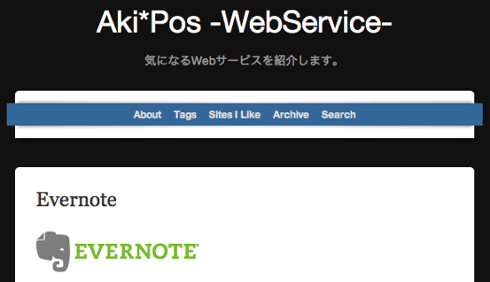

Posterousで新しいブログを始めました。  
実際に利用したことのあるWebサービスについて語ってます。  
よろしければチェックしてみてください！

<a href="http://aki19v3.posterous.com" title="Aki*Pos -WebService-" target="_blank">Aki*Pos -WebService-</a>

Posterousブログもついに3つめです。

■<a href="http://aki19.posterous.com" title="Aki*Pos" target="_blank">Aki*Pos</a>  
iPhone,iPadアプリレビューサイト  
■<a href="http://aki19v2.posterous.com" title="Aki*Pos -Android-" target="_blank">Aki*Pos -Android-</a>  
Androidアプリレビューサイト  
■<a href="http://aki19v3.posterous.com" title="Aki*Pos -WebService-" target="_blank">Aki*Pos -WebService-</a>  
Webサービスレビューサイト

もうこれ以上増えることはないと思います・・・。  
上記以外の話題は今後も当ブログで扱っていく予定です。

これを機に、Aki*Posシリーズ全部をまとめてチェックできるサイトを作ってみました。

<a style="color:#0070C5;" href="http://alicesystems.lomo.jp/labo/apreader/index.html" target="_blank">Aki*Pos Reader</a> 

3つのサイトから5件ずつ記事を取ってきて、時系列に並べているだけのサイトです。  
（まだ微妙に調子悪いときがあるので記事が少なかったらページの更新をお願いします・・・。）  
だからなんだという感じではありますが・・・これを参考にしながら今後は平均的に記事を挙げていきたいなぁと考えているところです。

ついでにポートフォリオサイトも作ってみました。

（閉鎖済）

こちらはまだまだコンテンツ自体作りかけです。デザインも調整中です。  
とりあえず×１０ぐらいの段階でリリースしてしまいました・・・。  
自分のサイトをまとめたリンク集＋ブログで配布したソフトやスキンなどをまとめるサイトにする予定です。  
配布物は来年もう少し増やせるといいなと思ってます。

以上、お知らせでした。
