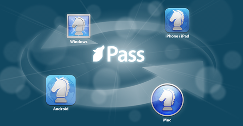
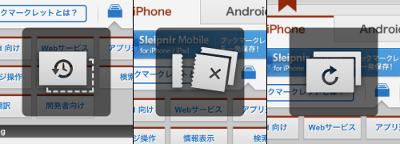
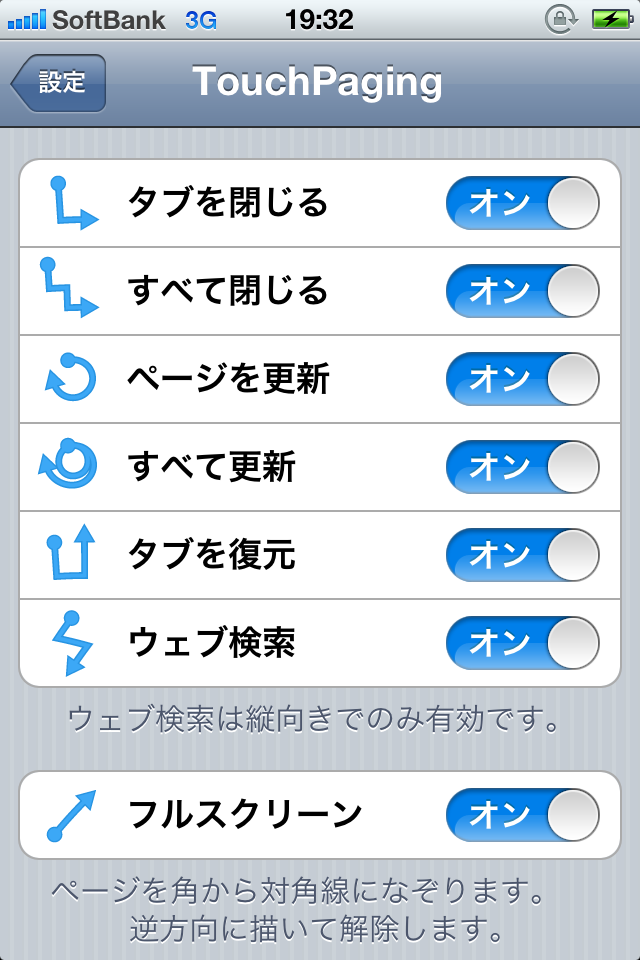

せっかくブログ持ってるので今回は公開ラブレターを書きます。

フェンリルが好きです。

フェンリルとは、皆さんご存知ブラウザソフト「Sleipnir」を開発している会社ですが、  
その他にもファイル整理ソフト「FenrirFS」や手書きアプリ「Inkiness」なども出してます。  
他企業とのコラボだと「ウェザーニュースタッチ」や「MUJI CALENDAR」が有名かな。  
（最近ではデベロッパーズブログも賑わっていて、結構はてブ稼いでますね。）

「Software meets Design」をミッションに掲げるだけあって、  
どのアプリケーションも美しいデザインと心地よいUIを提供していて、  
如何に機能が優れていてもUIが並なソフトは使う気にならない私にとっては、  
出すアプリ出すアプリツボで、もう信者といっていいでしょう。

そんなフェンリルですが、最近「Sleipnir 3 for Windows」の正式版をリリースしました。  
ようやくの3だったわけですが、私の中で新機能の目玉はFenrir Passとスマフォを意識した操作性。  
今回はそのあたりをちょっとご紹介します。  
Mac版やiPhone版でも共通することなのでWinユーザー以外も御覧ください。  
皆さんにちょっとでもSleipnirいいなと思っていただければ幸いです。  
信者の言うことは当てにならん、などと言わずどうかお付き合いください。

<!--more-->

**すべてのデバイスでブックマーク同期**

今までSleipnirはWindows版しかなかったのですが、  
ここにきてMac,iPhone,iPad,Android,Windows Phone（まだベータ）、と  
様々なデバイス向けにリリースされました。  
そこで気になるのがブックマーク。  
Fenrir Passとはこれらのデバイス間でブックマークを同期できるサービスのことです。  
私の場合、Windows Phone以外は全て持っているのでこの機能は必須です。  
残念ながらSleipnir3は現時点のバージョンだとサードパーティの拡張機能に完全対応していないので、  
ブックマーク同期で有名なXmarksなどは使えません。

2011/11/21　追記  
Geckoエンジンを使えば、Firefoxアドオンも使えます。  
ですが、Xmarksはインストールはできるのですがうまく動きません。

ですが、このようにSleipnir間でなら同期出来るのでご安心ください、というわけです。  
いずれはログイン情報なども同期対象になるとのこと。期待できますね。

**タッチ操作がすごい**

これは特にモバイル版で先行して体験していて手放せなくなった機能なのですが、  
ルールに従ったタッチ操作でブラウジングがものすごく快適になります。  
例えば、「L字型にジェスチャする」とタブを閉じれたり、「横にスワイプする」と他のタブに移動できたり。  
思わず他のアプリでもやってしまいそうになるほど便利です。  
（Windows版ではマウスの右ボタンを押しながらタッチ操作できます。  
Mac版だと二本指でスワイプしてタブ移動はできますが、他は未対応。）  
他にも「リンクを長押し」でバックグラウンドで開いたり、「タブをダブルクリック」で保護できたり。

この機能はやっぱりモバイル版でやるのが一番便利を実感できるし、何より楽しいです。  
私がよく使うジェスチャは以下の通りです。

・L字ジェスチャ・・・閲覧中のページを閉じる  
・タブ一覧で下にフリック・・・タブを閉じる  
・左下から右上にジェスチャ・・・フルスクリーン切り替え。右上から左下で元に戻す。  
・S字ジェスチャ・・・検索

iPhone版のヘルプページも貼っておきます。

便利なので是非！是非！

**いかがですか、Sleipnir**  
ここまでお勧めしてきましたが、今回の記事タイトルは「サブブラウザにSleipnirはいかがですか」。  
信者な私でもメインブラウザはFirefoxやChromeです。  
ちょっと紹介したとおり、現バージョンは拡張機能に対応していません。  
1Passwordなど手放せないアドオンがあるので、この時点でSleipnirをメインには出来ませんでした。  
ならば何故わざわざサブブラウザなど使うのか。

それはやっぱり使っていて気持ちいいからです。  
ご紹介した機能＋リッチなデザインを備えたSleipnirは使っているだけでなんだか楽しいんです。  
私の場合、ネットサーフィンしながら情報収集するのに最適です。  
感情的な話だけでなく、そのためにベストな機能をもったアプリだと思っています。

それに、今のPCですごく高性能ですよね。  
用途に合わせてブラウザを切り替える余裕はあると思うのです。  
いかがでしょう、Sleipnir。

ロードマップも公開されていますが、  
ユーザーの声を聞きながらどんどん進化していってほしいなぁと思います。  
最近のデベロッパーズブログを読んでいるとフェンリルはそれができる会社のような気がするのです。

<a href="http://www.fenrir.co.jp/" title="フェンリル" target="_blank">フェンリル</a>

<a style="color:#0070C5;" href="http://www.fenrir.co.jp/sleipnir3/" target="_blank">Web ブラウザ Sleipnir 3 for Windows &#8211; 驚きと感動のスクロール。かつて PC になかった体験</a> 

<a style="color:#0070C5;" href="http://www.fenrir.co.jp/mac/sleipnir/" target="_blank">Sleipnir 3 for Mac &#8211; 指先で、流れるようなタブ切り替え</a> 

Sleipnir Mobile

Fenrir Inc.無料posted with<a href="https://mama-hack.com/app-reach/" title="アプリーチ" target="_blank" rel="nofollow">アプリーチ</a>

Sleipnir Mobile Black Edition

Fenrir Inc.¥730posted with<a href="https://mama-hack.com/app-reach/" title="アプリーチ" target="_blank" rel="nofollow">アプリーチ</a>

