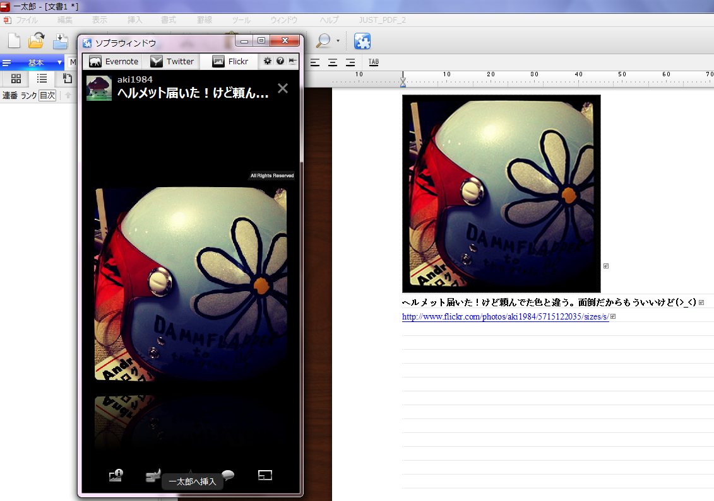

今回は対象者がかなり限られるTipsです。  
JustSystemsのソプラウィンドウを使います。

ソプラウィンドウとは「一太郎2011 創」に搭載されたミニソフトで、いろいろな外部サービスと連携して一太郎による書類作成を手助けするものみたいです。たぶん。  
「一太郎2011 創」はWindows版しか出ていないのでMacユーザーさんはごめんなさい。

ソプラは、プラグインを追加する形で機能拡張していき、  
すでにTwitterやFlickr用のプラグインが公開されています。  
例えばFlickrプラグインを使うことでFlickrにアップロードされた写真を簡単に一太郎に挿入することができます。

先日ついにEvernoteプラグインが公開されました。  
今回はその使い道を考えてみました。

はじめに注意書きしておくと、ノートの編集は出来ません。  
編集自体は一太郎でやらせたいのでしょう・・・。  
なので閲覧から考えられる使い道。  
それが今回の記事タイトル、スニペットの利用です。

私はEvernoteにコードスニペットを貯めてます。  
ただ実際にこれを使おうとなると、Evernoteのクライアントを開いて・・・ノートを選択して・・・コピペして・・・クライアントは邪魔だから閉じて・・・っとちょっと面倒でした。  
そこでソプラ。  
ウィンドウは小さめなので常時開いていてもたいして邪魔になりません。  
ソプラでは常にスニペット収集用のノートブックを開いておけば、どんなスニペットを貯めていたか一目瞭然ですし、そこからノートを開いてコピペすればすぐに使えます。  
（もちろんコピペなので一太郎以外に使えます。）

もちろん公式のクライアントでもいろいろなビューを非表示にすればノート一覧だけのウィンドウにすることは可能です。  
ただ、ノートを開くときに別ウィンドウになってしまいますし、他のことで利用するときに表示を元に戻すのは面倒ですよね。

対象者はかなり限られますが、いかがでしょうか。  
他にもいい活用法があれば是非教えてください！

※私はノート数が1300ぐらいあるのですが、初回同期はかなーり遅いです。  
その後も読み込みがけっこうかかるみたいです。  
ただ、ローカルDBが作られればそんなに気にならなさそうです。

<http://www.ichitaro.com/sopla/>
