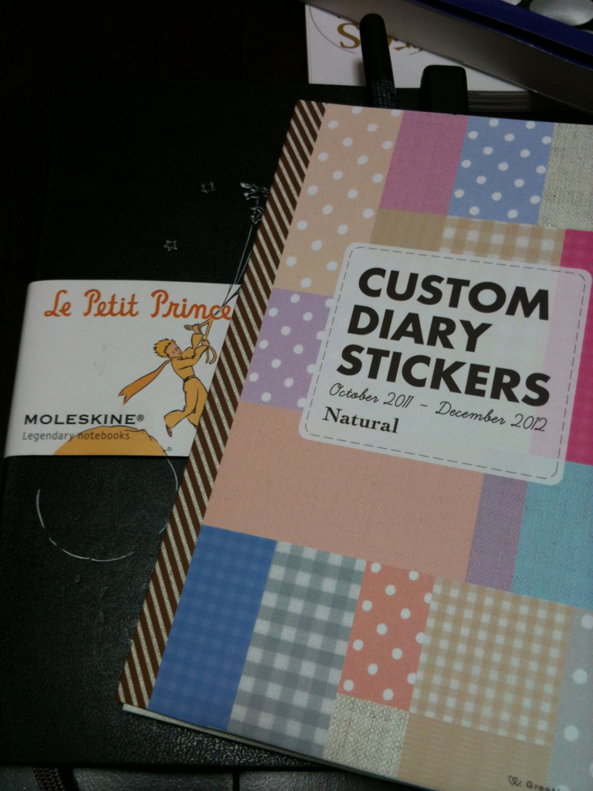
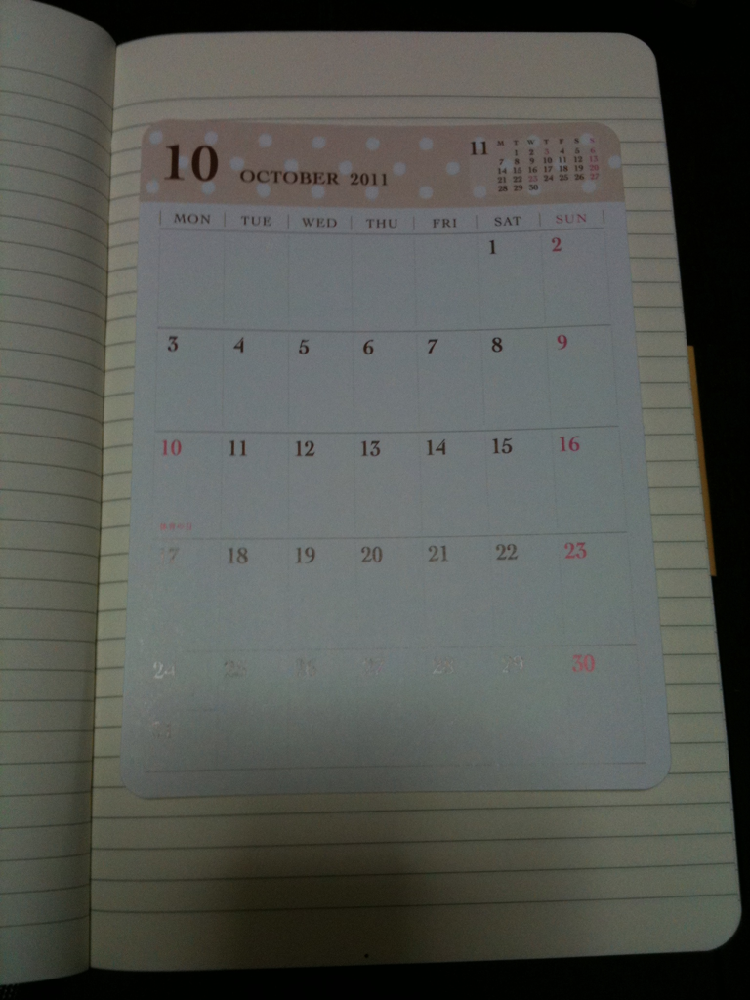

今年から手帳を持たずに普通のモレスキンを手帳がわりに使っています。  
ノートの裏表紙に年間カレンダーを貼り、月のはじめには月間カレンダーを印刷して貼っていました。  
これが、とにかく面倒くさい。

これはただ単に我が家の事情ですが、調子の悪いプリンターをひっぱって、  
A4用紙にカレンダーを印刷して、モレスキンに貼れるサイズにハサミで切って、  
カレンダーに日付書いて・・・、とにかく面倒でした！

ですが、今日Loftでなかなか良さそうな文房具を見つけてきました。  
それが冒頭の画像にあるもの。

ただのシールセットなのですが、年間カレンダーと月間カレンダーに加え、  
インデックスシールとシールを収納するポケットもついてきます。  
これで680円。  
大きいサイズと小さいサイズがあり、デザインもいくつかありました。

ラージサイズのモレスキンにあわせるとこんな感じです。

カレンダーは10月からなのでまだ使えませんが、これで毎月のストレスが軽減されそうです。

公式HPにデザインや使い方がちょっとだけ載っていました。  
<http://www.greetinglife.co.jp/cds2/cds_howto.html>  
私はLoftで買いましたが、ネットで買えるかどうかはちょっとわかりません。
