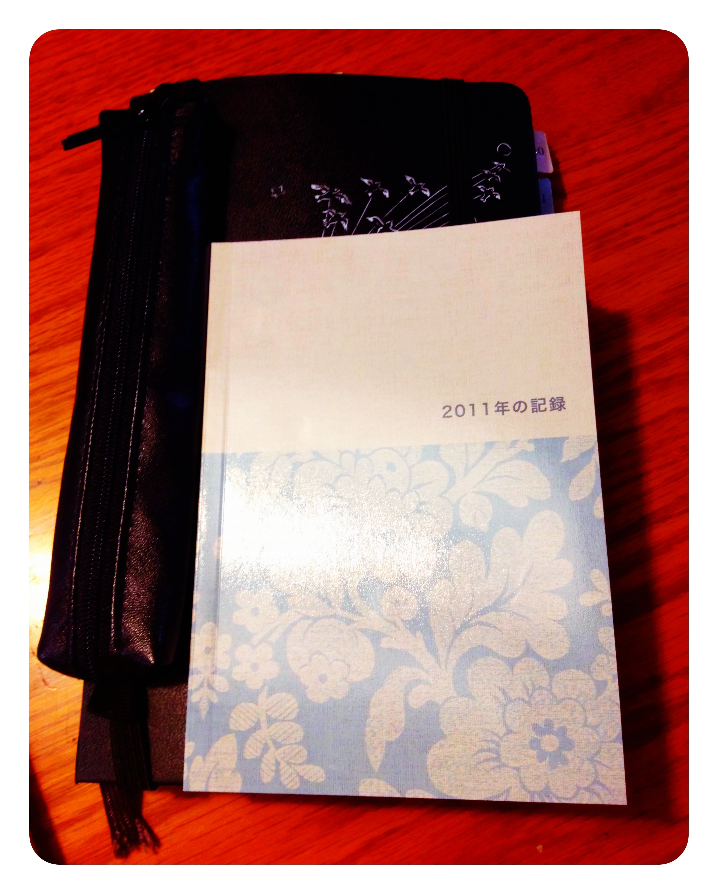

もうすぐ2011年もおしまいです。

今年は結婚式やハネムーンなど個人的にイベントごとが多く、  
例年に比べて写真をたくさん撮った一年でした。  
文字で綴る一年、はモレスキンに書きたいなと思っていたのですが、  
写真はどうしようかなーと考えていたところ以下のサービスを知りました。

<a style="color: #0070c5;" href="http://tolot.com/" target="_blank">フォトブックサービス「TOLOT」登場！A6サイズ・64ページ・フルカラー1冊500円（送料無料・税込み）</a>   
64ページのフォトブックを作れるサービスです。  
アルバムの編集用としてiPhoneアプリもあります。  
ただ、デスクトップアプリで編集したほうが安定していますし写真も見やすいと思います。

 **TOLOT 1.2.5（無料）**  
カテゴリ: 写真／ビデオ, ブック  
販売元: <a href="http://itunes.apple.com/jp/artist/flipclip/id443357359?uo=4&#038;at=11l9Ag" rel="nofollow" target="_blank">FlipClip &#8211; FlipClip, Inc.</a>（サイズ: 8.2 MB）

通常500円のところ、新規登録で半額のキャンペーンをしていたので試してみました。  
2011年に撮った写真をピックアップして時系列に並べて注文。  
出来たフォトブックが冒頭の写真です。  
注文して3日ぐらいで届きました。

文庫本サイズなのでけっこう小さいですし、画質もそこそこ。  
レイアウトもただ写真を並べるだけではありますが、  
250円は安い！  
薄いので持ち運びも手軽。紙なので家族にも喜ばれました。  
（iPhoneで写真を見せても、怖がってこっちがめくらないと次の写真を見てくれない人多いんですよ。）

この一冊で今年一年何があったのかがすぐにわかるので、  
いい振り返りになりました。  
来年もこのサービスがあれば、毎年作りたいなと思いました。

さあ、次はモレスキンに一年のまとめを書きたいと思います。  
皆様、良いお年を！
