前回はToodledo＋2Doを使ってGTDスタイルを構築するための、基本的な設定をまとめました。

[Toodledo+2Doを使ったGTD構築方法①基本編]()

これだけでも基本的なタスク管理は出来ますが、今回はもう少し掘り下げて、

2Do独自の機能を組み合わせればもっとステキにタスク管理できるよ！というところを

２回にわたってご紹介したいと思います。

## 目次

  1. 2Doで扱えるタスクプロパティ一覧
  2. 2Doを使えばGTDのプロジェクトが扱える！
  3. タグを使ってみよう
  4. 場所と関連付けてみよう
  5. MTGタスクは2Doでレコーディングしてセットで管理しよう
  6. （おまけ）消化タスクのアーカイブはEgretlistで行う

今回は３章まで。

<!--more-->

## 利用するサービス＆ソフト

[Toodledo][2]

2Do - Todo List, Tasks &amp; Notes

Beehive Innovations Services無料posted with<a href="https://mama-hack.com/app-reach/" title="アプリーチ" target="_blank" rel="nofollow">アプリーチ</a>

※以下の2Doのスクショは基本的にiPad版の必要な部分を切り取ったものです。

## 2Doで扱えるタスクプロパティ一覧

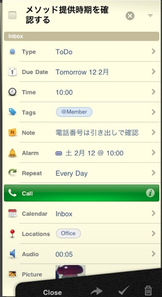

※画像では切れていますが、もう一つURLも。

※この並び順は前回ご紹介したとおりお好みで設定できます。

2Doではこんな感じのプロパティをタスクに関連付けることが出来ます。

Toodledoのプロパティだけでなく2Doオリジナルのプロパティもあります。

上図のように設定した場合一覧画面では次のように表示されます。

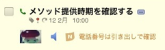

この表示だけでアクションの種類、タスク名、タスクの種類、アラートの種類、タグ付き、場所付き、

日付、画像、音声付き、ノートの内容、が確認できますね。

ここでは後述するタスクの種類、タグ、場所、音声以外で特徴的なプロパティについて

簡単に説明します。

※画像と音声についてはMobileMe用なので設定はできますが、Toodledoはサポートしていないので

iPad←→iPhone間の同期すらできません。

### アクションの種類

タスクがどういうアクションを行うべきものなのかを設定できます。

設定できる種類は、電話、SMS、メール、URL、訪問、検索。

かつ、それぞれの詳細なメモも可能です。

例えば、電話なら相手の電話番号も設定しておくことができるので、

いざ実行するときにはすぐ電話できます。

メールならメルアド。設定済みの場合、タップするとすぐにメールの作成画面が開きます。

### アラートの種類

アラートはメッセージボックス、サウンド、メールが選べます。複数もOK。

メッセージの内容とかまではカスタマイズできません。

## 2Doを使えばGTDのプロジェクトが扱える！

ここが2Doの特にすごいところ！

Toodledoだけではできないプロジェクトを作成することができるのです！

GTDのプロジェクトとは、タスクが完了するまでに複数回行動が必要なものですね。

これはタスクの種類・・・Typeで設定します。

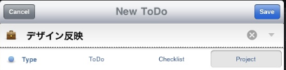

通常のタスクはToDoを選択しますが、ここでProjectを選択します。

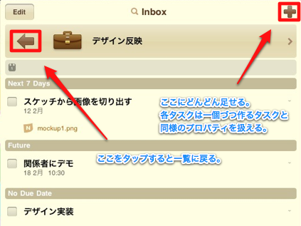

すると上図のような画面が表示されます。

これで、このプロジェクトを完了させるために必要なタスクをどんどん追加できるようになります。

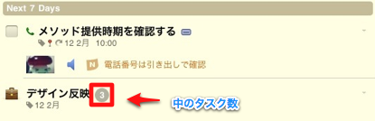

一覧画面はこんな感じ。

ちなみにChecklistを選択すると下図のようになります。

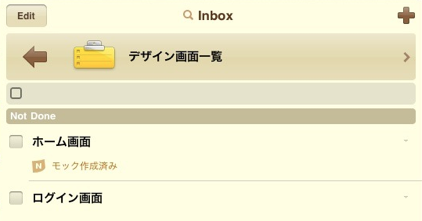

チェックリストのタスクは、追加するとどんどん新規タスク画面が開くので、

タスク追加が非常にテンポよく行えます。ただし、各タスクに期日は設定できません。

なお、すでにあるタスクをプロジェクトに入れることも簡単に出来ます。

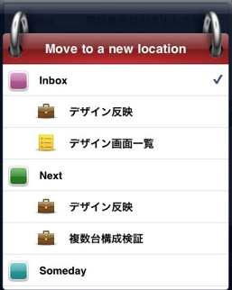

はずすことも同様の手順で可能です。

タスクプロパティのカレンダー選択でこの画面が開きますよ。

最後にちょっと注意事項。

2Doは2Doオリジナルのプロパティを扱えるようにするため、

ノートにメタデータをつけて管理しているようです。

なので、オリジナルプロパティを設定したタスクのノートが汚れてしまいます。

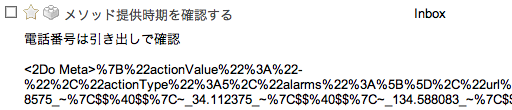

Webで見るとこんな感じになってしまいます。

ただ、もちろん2Doで見ればメタデータは表示されませんし、

ノートが使えなくなるわけではありません。

## タグを使ってみよう

2Doではフォルダーかコンテキストのどちらかしか使えないため、

コンテキストがわりにタグを使うのが良いでしょう。

Webではタグを設定するときに候補として表示されるのは、

すでにどれかのタスクに設定済みのタグだけなので設定が面倒ですが、

2Doではあらかじめ追加しておくことも出来ますし、その中から選択することが可能なので簡単です。

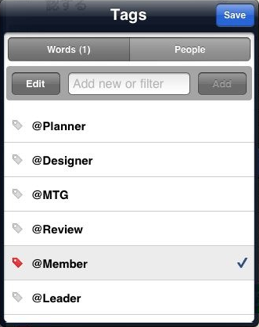

Wordsは好きな言葉を設定できるのでコンテキストっぽく@付きで設定してみました。

ちなみにPeopleはアドレス帳からピックアップ出来ます。

検索もできます。

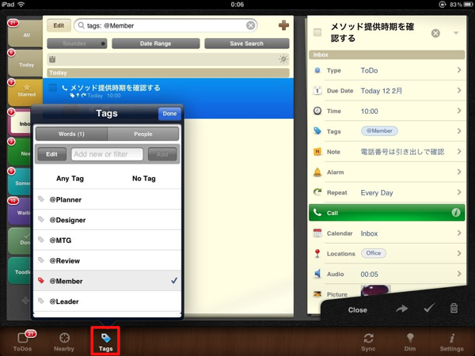

iPad版はここから。

選択したタグの付いたタスクをすぐに検索できるのでコンテキストがわりに運用できそうですよね。

iPhone版はちょっとわかりにくいかも。

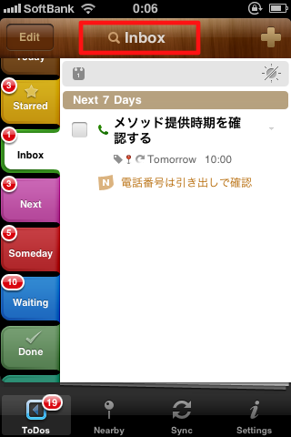

まず検索したい場所で上部バーをタップして・・・

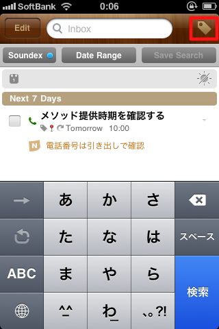

表示された検索画面でタグアイコンをタップ。

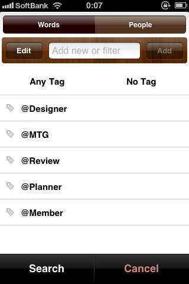

これでようやくタグの検索画面にいけます。

次回は場所プロパティ、音声プロパティの使い方と、

私のGTDスタイルを実現するために、消化したタスクをどのようにEvernoteに送ったのかを

ご紹介したいと思います。

[Toodledo][2]

2Do - Todo List, Tasks &amp; Notes

Beehive Innovations Services無料posted with<a href="https://mama-hack.com/app-reach/" title="アプリーチ" target="_blank" rel="nofollow">アプリーチ</a>

 [2]: http://www.toodledo.com/
