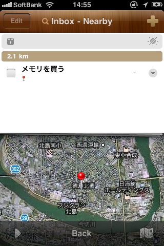
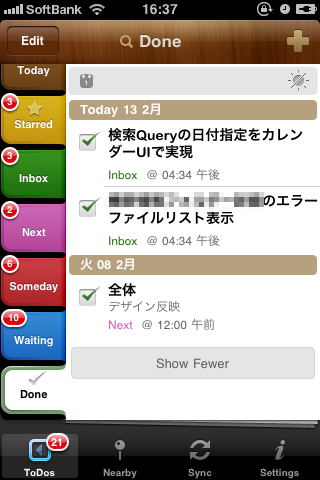

Toodledo+2Doを使ったGTD構築方法のご紹介。

[Toodledo+2Doを使ったGTD構築方法①基本編]()

[Toodledo+2Doを使ったGTD構築方法②応用編１]()

長くなってしまいましたが、いよいよ最終回です。

（もっとブログ書くのに慣れてたらこんなことにはならないはずですが・・・すみません。）

## 目次

  1. 2Doで扱えるタスクプロパティ一覧
  2. 2Doを使えばGTDのプロジェクトが扱える！
  3. タグを使ってみよう
  4. 場所と関連付けてみよう
  5. MTGタスクは2Doでレコーディングしてセットで管理しよう
  6. （おまけ）消化タスクのアーカイブはEgretlistで行う

今回は４章から。

あと、今回は最後に、小さいTipsや使っていてはじめて気づいた機能の紹介もしたいと思います。

<!--more-->

## 利用するサービス＆ソフト

[Toodledo][3]

2Do - Todo List, Tasks &amp; Notes

Beehive Innovations Services無料posted with<a href="https://mama-hack.com/app-reach/" title="アプリーチ" target="_blank" rel="nofollow">アプリーチ</a>

※以下の2Doのスクショは基本的にiPhone版です。

## 場所と関連付けてみよう

携帯端末ならではの使える機能その１。それがタスクプロパティのLocationsだと思います。

タスクにLocationsを設定すると、Nearby画面から半径10km以内のタスクを確認できるようになります。

手順は以下の通りです。

タスクを追加する際にLocationsを設定すると今まで設定済みの場所が並ぶ画面になります。

この中にあればここから選択すればいいのですが、今回は新しく場所を設定してみます。

※塗りつぶし部分には住所が表示されます。

場所名を入力後にAddすると位置情報の設定をどのように行うのか選択するリストが表示されます。

今回は近所の店なので現在地から編集して設定します。

なのでとりあえず「Current Location」を選択。

作成された場所を編集して実際の店の場所に設定しなおします。

地図をドラッグして店を中心に表示させ、「Re-drop Pin」を選択。

これで実際の店の場所に設定できました。

メイン画面から下バーのNearbyタブをタップすると現在地から半径10km以内で

実行出来るタスクが並びます。

ここで下の地図アイコンをタップすると・・・。

実際の地図が表示され、詳細な場所の確認ができます。

場所は設定画面のManage Locationsからあらかじめ設定しておくことも可能です。

その他半径10kmを1kmにしたり、などの設定は設定画面のNearbyからどうぞ。

この機能は私のように内勤の人間にとっては、仕事タスクではあんまり使い道がないかもしれません。

ただプライベートの買い物タスクではけっこう良さそう。

私は田舎に住んでるので久々に都会に出るときとかに一気に買い物します。

そういった場合に備えて買い物タスクに場所を設定しておけば、効率的にまわれそうですよね。

ただ、残念ながらこのLocationsはWeb版のLocationとは同期しません。

逆にWebから設定したLocationを2Doから確認することもできません。

iPhone←→iPad間なら確認できます。

Locationは2DoオリジナルではないのでいつかはWebとの同期に対応してくれる可能性はあります。

## MTGタスクは2Doでレコーディングしてセットで管理しよう

携帯端末ならではの使える機能その２。タスクプロパティのAudioの使い方をご紹介します。

この機能を使ってMTGタスクなどで会議を録音しておけばセットで管理できて便利かも。

手順は以下の通りです。

タスクにAudioを設定するとこのように録音画面が表示されます。ステキ！

もちろん真ん中の丸ボタンをタップすることで録音開始。

録音した音声の再生画面はこんな感じ。

この音声ファイルをメールしたり、削除したりもこの画面で行います。

音声ファイルはaif形式になります。

残念ながらAudioは2DoオリジナルプロパティなのでWebでは確認できません。

また、このプロパティに関してはiPhone←→iPad間の同期もできません。

## （おまけ）消化タスクのアーカイブはEgretlistで行う

私のGTDスタイルについては以前記事にしました。

[私とGTD：会社編①運用方法]()]

週の最後に一週間で消化したタスク一覧のスクショをEvernoteのひとつのノートに日付つきで放りこみ、

画像認識を利用してやったことが後から確認できるようにしています。

これを2Doを使っても続けたかったので、最初はiPhoneでDoneタブ画面をスクショして、PCに送り、

今までのようにPC版Evernoteで整形しようと思ってました。

（Doneタブは2Doの設定画面からToDos→Show Done in ToDosで好きな期間を

設定して表示させることが出来ます。）

が、これだとPCに送ったりするところが面倒。

そこで、Egretlistです。

Egretlist（公開終了）

もともとEgretlistでも確認できる形式で画像をくっつけていたので、

この「確認できる形式」を前回の記録からコピペしたりして再現するのが面倒でした。

（ただTODOの下に画像を貼っても認識してくれないので）

ならはじめからEgretlistを使えばいいじゃないか！

まずは、Doneタブ画面のスクショを撮ります。

 

Egretlistを立ち上げて、作業記録ノートを表示。

ノート名の上でスライドしてタスクの追加アイコンをタップ。

タスク名に期日を入力して先ほど撮ったスクショを添付します。

期日の入力に関してはEgretlistはTextExpanderに対応しているので、手早く入力できると思います。

これで保存。

タスクが追加されました！

これで今まで記録してきたノートの形式を変えずに、かつ、前より簡単に記録することができました。

このタスクをチェックして消化し、私のアーカイブ作業は完了です。

## その他の機能

最後にちょっとだけ。

今まで紹介していない2Doの便利機能をご紹介します。

### 時間の設定方法がちょっと面白い

タスクに時間を設定するときのUIがかわいいです。

針をころころして設定できます。

面倒な方は下のアイコンをタップすれば時計アプリのアラームみたいに普通に設定することもできます。

2Doには他にもステキUIが色々。

特にタスクを削除した時のエフェクトはすっごくかわいいです！試してみてください。

### TextExpander対応

TEに対応しています！

設定画面のExperienceから。

 

こんな感じでTextExpanderによく使いそうなスニペットを登録しておけば、

タスク名の入力が簡単になります。

### 便利なショートカット機能

これは今回レビューを書くまで気付かなかった機能です。

タスクを長押しするとこんなメニューが。

ここからさっと期日を設定したりタスクの複製とかができるんですね。便利。

オーディオの追加をタップすればすぐに録音できる環境が！

これでToodledo+2Doを使ったGTD構築方法のご紹介はおしまいです。

長い間お付き合いいただいてありがとうございました！

2Doは高機能かつ美しいUIで、本当におすすめできるアプリです。

アップデートもちゃんとありますし、その度にどんどんよくなっていると思います。

今現在800円しますが、タスク管理系のアプリでは比較的安いほうかと思います。

しかもユニバーサルアプリですし！

まだ買ってない方は是非検討してみてくださいね。

2Do - Todo List, Tasks &amp; Notes

Beehive Innovations Services無料posted with<a href="https://mama-hack.com/app-reach/" title="アプリーチ" target="_blank" rel="nofollow">アプリーチ</a>

そしてなによりToodledo！

これがないと始まりません。

[Toodledo][3]

Web版のUIは本当に死んでるというか見た目にこだわる方にとっては残念すぎるUIですが、

Remember The Milkに比べて無料でもけっこう使えるいい子です。

今回は2Doから使う方法をご紹介したので、2Doがサポートしていない機能については

一切ご紹介しませんでしたが、タスクの作業時間を記録できるTimerというプロパティがあったり、

Statusというプロパティを使えばそもそも独自にGTDカテゴリーを作成することなく

GTDできたりします。

Toodledoについてはシゴタノなどでたくさん紹介されていますし、

使っている方も多いので色々参考になる記事があると思います。

  <table border="0">
    <td valign="top" width="150">
      
    </td>
    
    <td valign="top">
      <strong><a rel="nofollow" target="_blank" href="http://cyblog.jp/modules/weblogs/4060">シゴタノ！ —    クラウド時代のタスク管理術入門／ビギナーズ・ハック第4回</a></strong>
 
      
      

      

      
      

        <strong>ToDoリストにクラウドを活用する</strong>
      

    </td>
  </table>

是非試してみてください！

 [3]: http://www.toodledo.com/
