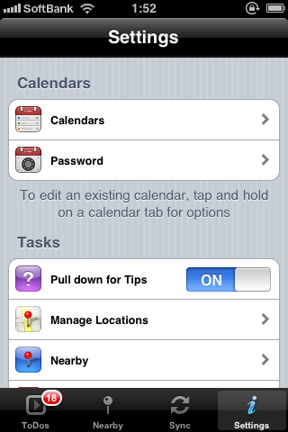

iPadを使ったGTD。

[前回]()は前置きだけで終わってしまいましたが、

今回はいよいよメイン。Toodledo+2Doを使ったGTDシステム構築方法をご紹介します。

<!--more-->

その前に私のGTDスタイル。

[私とGTD：会社編①運用方法]()]

詳しくは上の記事で書きましたが、簡単にまとめると・・・。

  * タスクはInbox,Next,Someday,Waiting,Think（プロジェクト）,Memoに振り分け
  * タスクには@MTGや@Plannerなどのコンテキストをつける
  * 期日の決まったタスクは別途Googleカレンダーへ登録

**日次レビュー**

  * 今日やることをNextからピックアップ
  * 今日行われるMTGがあればWaitingからNextに移動
  * タスク消化によってSomedayから格上げできるものが発生したらNextへ

**週次レビュー**

  * 一週間で消化したタスク一覧を日付とともにEvernoteへ
  * 消化タスクを全部削除
  * Thinkから具体的なアクションが思いつけばNextかSomedayへ

こんな感じでやってます。

なので、以下はなるべくこのルールで運用できるように設定したものになります。

## 利用するサービス＆ソフト

[Toodledo][2]

2Do - Todo List, Tasks &amp; Notes

Beehive Innovations Services無料posted with<a href="https://mama-hack.com/app-reach/" title="アプリーチ" target="_blank" rel="nofollow">アプリーチ</a>

## Toodledo側の設定

### フォルダー作成

まずは、Toodledoでタスクを振り分ける先のフォルダーを作成します。

Toodledo左メニューの「Folders」から設定できます。

今回はInbox,Next,Someday,Waitingを作ってみました。

### タスクのプロパティを決める

タスクには期日やステータスなど様々なプロパティを設定できます。

左メニューの「Account Settings」で設定画面に飛び、

「Fields/Functions Used」のeditで編集できます。

このあたりはお好みで。

コンテキストはオフにしています。理由は後で説明します。

### ical→Googleカレンダー

iCalのURLは左メニューの「Tools & Services」からCalendarsの設定画面で確認できます。

いくつかURLが並んでいますが、GoogleカレンダーではEventsのURLを使います。

ただ、これはちょっと微妙です。

今のところ2Do側から開始期日を設定する方法がないので。（終了期日はできる）

あと、何故かカレンダー名が文字化けされてしまいます。

ここはまだ手動で登録する必要がありそう・・・。

2/11 追記：終了期日だけでちゃんと反映されてました。ただ、Gcal側へ反映されるのが遅いみたいです。  （これはGoogle側の問題かも）

## 2Do側の設定

※私はiPadで使う予定ですが、画像が小さくて済むので以下はiPhone版のスクショで説明します。

これがメイン画面です。

これが設定画面です。

2Doはとにかく設定項目が多く、日本語化もされていないのでちょっと大変ですが、

今回は必要最低限の部分だけ説明します。

### 左タブに並べる項目を選ぶ

ここで大事な決断をしなければなりません。

2Doではフォルダーかコンテキストのどちらかにフォーカスをあてて管理することになります。

選択した項目は左側にタブのように並びますが、

選択しなかった項目は一切表示されなくなります。編集もできません。

なので、フォルダーをNextなどのカテゴリーで使い、コンテキストを@MTGのように使っているとダメです。

設定は「Settings」→「Sync」→「Sync 2Dos Tabs as Folders」から。

私はフォルダーを選び、コンテキスト代わりにはタグを使うことにしました。

タグはけっこう便利な機能です。詳しくは後述します。

Toodledoと同期するとフォルダーがタブで並び、

タスクを一覧することができるようになります。

### タスクのプロパティの設定

プロパティの表示・非表示や並び順を変更することができます。

設定は「Settings」→「ToDos」→「Arrange Properties」から。

ここでオンにした項目はタスク画面でデフォルトで表示されるようになり、

オフにするとはじめは隠れるのでシンプルで使いやすい画面になります。

## 基本編終了

一応以上が基本の設定。

あとは同期のタイミングやバッジに表示するタスクの条件などをちょこちょこいじれば、

自分好みの運用ができると思いますが、

2Doは色々と便利な機能があり、これを使うともっとステキにタスク管理できます。

次回はこの便利な機能の使い方をご紹介したいと思います。

具体的には2Doでプロジェクトを扱う方法や、タグの活用方法など。

それでは次回も興味がおありでしたらお付き合い下さい！

[Toodledo][2]

2Do - Todo List, Tasks &amp; Notes

Beehive Innovations Services無料posted with<a href="https://mama-hack.com/app-reach/" title="アプリーチ" target="_blank" rel="nofollow">アプリーチ</a>

 [2]: http://www.toodledo.com/
