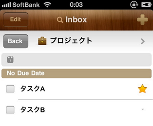
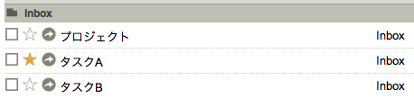
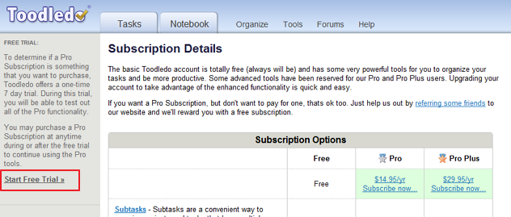
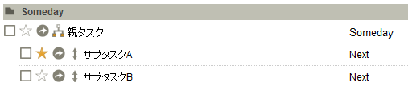
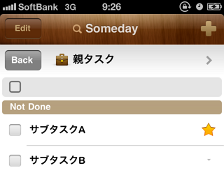

ついについに<a href="http://www.toodledo.com/index.php" target="_blank">Toodledo</a>をアップグレードしました！

私のタスク管理方法は、以前書いたとおりToodledo＋2Doアプリで運用しています。

[Toodledo+2Doを使ったGTD構築方法①基本編]()

Toodledoにはだいぶ昔からお世話になっているのですが、  
今までずっと無料版で運用していました。  
無料版で不満な点は私の場合タスクのサブタスクを作れないことなのですが、  
2Doを使えばタスクをプロジェクト化することが出来るので、  
一応タスクの階層化が出来るのです。

（この機能、記事を書いた当時はToodledoのノート機能を使って実装されていたので、  
ノートに勝手に文字列が入ってしまうのが難点でした。  
今は違う方法で実装しているようで、問題ありません。）

ですが、ここ最近会社では2DoからよりもWebから直接見ることが多くなってきました。  
2Doのプロジェクトは2Doの機能なので、Webから見るとこんな感じに・・・。

タスクが並列化して見えてしまうのです。  
タスクの小タスク化もWebからはできないので、ちょっと不便でした。

そこで、思い切ってアップグレードすることに！  
サブタスク機能を使いたいだけなので、プランはProプラン。  
年額14.95ドル。  
十分安いのはわかっているのですが、私はケチな人間なのでけっこう迷いました（汗）  
特に年額って点が・・・（かといってOmniは高すぎ・・・）  
ただ、今「シゴタノ！」で連載されているToodledoの使い方特集を見て、  
やっぱりサブタスクは便利そうなので覚悟を決めました。  
特に以下の記事が参考になりました。

<a style="color: #0070c5;" href="http://cyblog.jp/modules/weblogs/8115" target="_blank">シゴタノ！ — Toodledoの使い方　第13回　管理におけるプロジェクトと実行におけるコンテキスト（前編）</a>   
Proプランの機能についてはよく知らなかったので、上記記事がかなり参考になりました。  
また、今回私はProプランを選択しましたがプランの違いは以下の記事が分かりやすいです。

<a style="color: #0070c5;" href="http://mylifelog.sunnyday.jp/wordpress/2011/01/17/7211/" target="_blank">ToodledoをProアカウントにしました | mylifelog</a>   
ではではアップグレード！  
・・・の前に、Proプランは７日間お試しできるということだったのでお試ししてみました。  
2Doでどう見えるのか気になっていたので・・・。  
お試しは、アップグレードのページの左側リンクから出来ます。

クリックするだけでお試し開始。  
以後は、この画面で後何日試用できるのかもわかります。

さっそくサブタスクを作成してみます。

これを2Doで見ると・・・

自動的に親タスクがプロジェクトになっている！  
完璧！と思われたのですが・・・

Toodledoのサブタスクはそれぞれフォルダを違うものに設定できるのですが、  
違うものに設定した状態で2Doと同期させると、サブタスクとして認識されなくなってしまいました！  
私はフォルダをGTDのNextなどに割り当てていたので、  
このへんは運用方法を見なおさないといけないかも・・・。

ただ、サブタスク機能自体は非常に満足したのでアップグレードすることに決定！  
試用期間終わったら契約します。  
というわけで・・・「Toodledoをアップグレードしました！」というよりは  
「Toodledoをアップグレードするよ！」みたいな内容になってしまいましたが・・・。

もし2Do連携関係で不安がある方は、検証してみるのでお気軽に @aki19 までどうぞ！
