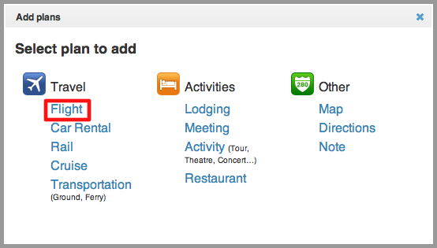
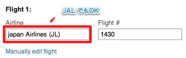
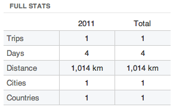

旅程表を手軽に作成・管理できる「[Tripit][1]」に登録してみました。  
といっても海外旅行に頻繁に行くわけではないので、国内旅行でも使えるのかなと試してみた感じです。

そもそもこのサービスの肝は、予約完了メールをTripitのメールアドレスに転送すると、  
日付や便を自動的に読み取って旅程表を作成してくれるところだと思いますが、  
結論から言うと、そこは無理でした。（JALで試しました）  
ただし、マニュアルで入力するときは便名だけでOKで、時刻は自動的にインプットされました。  
ここだけちょっとわかりにくかったのでメモがてら。

JALの飛行機を利用する場合・・・。

プランの追加で「Flight」を選択。

Flight情報としてAirlineに「Japan Airlines (JL)」か「JAL」と入力し、便名も入力。

するとこんな感じできちんと認識され、時刻は自動的にセットされます。

本当は予約完了メールで読み取れればベストですが、一応使えました。  
TripitはGoogleカレンダーに予定を出力してくれるので、  
マニュアル入力オンリーになってしまいますが、けっこう便利なんじゃないかなと思います。  
無料のiPhoneアプリもあるのでデジタル旅程表としてうまく使えそうです。

あと、面白いのが旅行の距離を測ってくれるところ。

１年でどれだけ移動したかわかるとちょっと楽しそうです。

 [1]: http://www.tripit.com/
