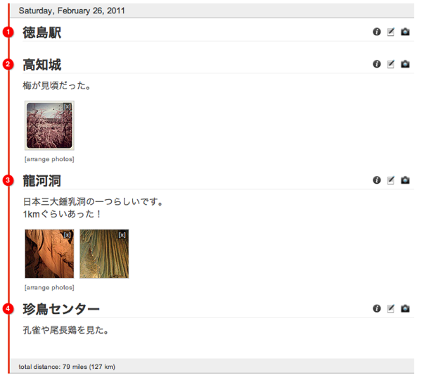

二十歳街道まっしぐらさんで面白そうなWebサービスが紹介されていたので、試してみました。

<a rel="nofollow" target="_blank" href="http://20kaido.com/archives/2588966.html">Foursquareの履歴からGoogleマップ上に旅日記を記録できるサービス「Tripline」*二十歳街道まっしぐら</a>

「Tripline」とは、簡単に旅行記が作れるWebサービスです。

使い方は二十歳街道まっしぐらさんが詳しく紹介されているので割愛しますが、

場所をFoursquareから取り込むことが出来たり、写真をFlickrから取り込むことが出来るので、

これらのサービスにチェックインしたり写真をアップロードしていれば、

ごくごく短時間でそれなりの見栄えの旅行記を作ることが出来ます。

私は普段から位置情報を記録したり、写真をアップしたりしているので、

「すぐに出来そうだな」と思い、早速試してみました。

できたのが[こちら][1]。

先週末高知を観光したので、その時の旅行記を作ってみました。

これを作って思ったのがこれをそのままEvernoteのノートにするといいんじゃないかな、ということ。

私の場合、旅行の記録はモレスキンにざっと書いて、

時期を見てEvernoteに旅行写真と一緒にアップしようと考えていました。

（モレスキン運用は今年からなのでまだ一度もしてないのですが・・・）

ただ、それだと関連する写真を集めるのも面倒ですし、レイアウトも美しくない。

さらに、Evernoteは自由フォーマットなので、

旅行によって書き方がバラバラだったりしそうだな・・・と思ってました。

そこで、「Tripline」！

作った旅行記を表示させて、ブラウザの拡張機能などからEvernoteに追加すれば、

体裁の整った旅行記ノートが出来ます。

（地図はFlashなので別途スクショを撮るなどして貼り付ける必要があります）

これならルートが一目瞭然ですし、

メモや写真（小さいですが）も確認できるので必要十分。

大きい写真が見たければ「Tripline」の旅行記を参照すればすぐ確認できるので問題ないかと。

余計な情報がうざければ「PrintWhatYouLike」とかで削りましょう。

<a rel="nofollow" target="_blank" href="http://milk200ml.blog73.fc2.com/blog-entry-441.html">Evernote と PrintWhatYouLike の組み合わせが便利すぎる！ 【 マインドマップ１年生 plus ライフハック！ 】</a>

これでまたひとつ、ステキな記録をEvernoteに残せそうです。

 [1]: http://www.tripline.net/trip/高知観光-2034470354211003B7219EC94ACC96EE
