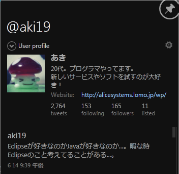
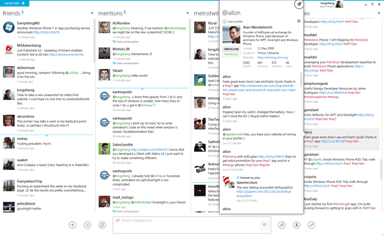
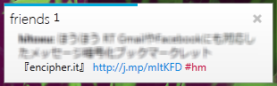
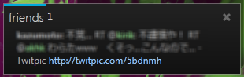

今日窓の杜で紹介されていたWindows用Twitterクライアントソフトがとってもステキだったので紹介したいと思います。

名前は「Metro Twit」  
各所で話題になっている「Windows Phone 7」に採用されたUI「Metro UI」にインスパイアされて開発された、ということで、フォント、レイアウトともに実に美しいソフトウェアです。  
今まで美しいソフトはみんなMac・・・と涙をのんできたWinユーザーも満足できるUIなのではないでしょうか。

画面はTweetDeckのようなマルチカラム。  
好きなカラムを追加することができます。  
メインウィンドウはこんな感じ。  

（上図は自分のタイムラインだとモザイクだらけになってしまうので公式からお借りしました。）

もちろん通知機能あり！  
通知ウィンドウはこんな感じです。  

この配色センス！  
ウィンドウが消えるまでのプログレスも美しい。  
ただ、アイコン表示はできません。  
これに関しては困る方もいらっしゃるかも。  
また、RTしたユーザー名は通知ウィンドウではわかりません。

テーマ機能もあります。ブラック大好き人間もOK。  

UI＆基本機能だけではなく、その他の機能もしっかりしています。

閲覧機能としては、短縮URLの展開表示（URLのコピーは短縮でも展開でも可能）や会話表示。  
入力機能としては、ユーザー名やハッシュタグの自動補完、URL短縮・・・などなど。必要十分ですね。

私はtwhirlから乗り換えました。  
UIの美しさはもちろんのこと、twhirlに比べて新着通知が圧倒的に速かったので。  
ただ、メモリはそこそこくうのでマシンによっては重いかもしれません。

動作には.NET 4.0が必要です。

<http://www.metrotwit.com/>
