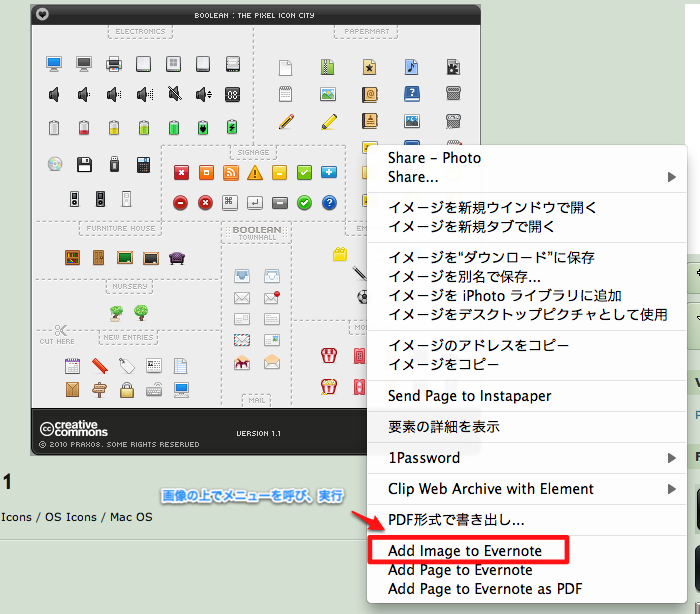
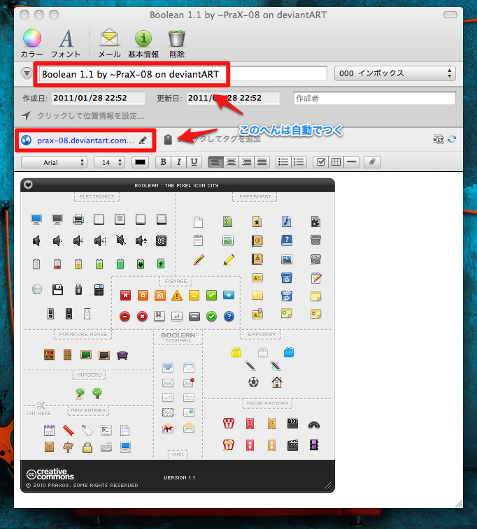
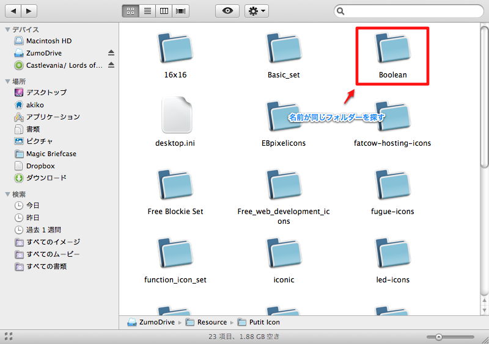

皆さん、Evernote使ってますか？  
そして、ZumoDrive使ってますか？

ZumoDriveとはオンラインストレージサービスのひとつです。  
ファイルを預けておくと複数のデバイスで参照できるようになるアレです。  
クライアントソフトもあるのでまるで本物のハードディスクのように扱えます。

そういうのはDropboxで間に合ってるよ！という方。ちょっと待ってください。  
ZumoDriveはDropboxとはちょっと違うのです。  
Dropboxにファイルを預けると基本的にそのファイルはローカル同期します。  
つまり、ファイル容量分実際のハードディスクも容量が減ります。  
だから実際のファイルと同じように扱えるのですが・・・、その反面  
Dropboxに何十GBも預けられるよ！といっても実際のハードディスク容量が数GBしか残ってなければ  
全てのファイルを同期することはできません。

一方ZumoDriveは預けたファイルはZumoDrive内に完結します。  
もちろんハードディスクの容量は減りません。  
その代わりアクセスには多少時間がかかります。  
（同様のサービスで今までSkyDriveを使っていましたが、遅すぎて困っていました。  
Twitterでどなたかがツイートされていたので乗り換えてみたところ今のところ快適です！）

ZumoDriveのすごいところは、自分でローカル容量をいじれるので  
Dropboxみたいに使うことも出来るし、一切ローカル容量を使わずに使うこともできるんですよー。  
ですが私の場合、ローカルを使わないところに惚れているので全然ローカルを使わずに運用しています。

そうなると、何に使うかという話になるわけですが・・・  
私はネットで見つけたアイコンや壁紙などの画像保管庫にしています。  
仕事でモックを作るときに使うため＆個人的にコレクション欲を刺激されて、  
ネットで美しいアイコンを見つける度にSugarSyncにつっこんでいたのですが、  
画像なのでたまりにたまるとそこそこ容量をくっていきます・・・。  
しかも、そんなに出番があるものでもないのでちょっともったいない・・・。

そこでZumoDriveですよ。  
バックアップメインに使えるZumoDriveはまさにこの用途にうってつけ！  
いつネットからなくなっても安心ですし、いざ使いたくなったら取り出せばいい。  
が、ここでちょっと問題発生。  
画像なので閲覧に多少時間がかかってしまいます。  
この用途にいい画像ないかなーと探す作業に時間がかかってしまうのでは、  
使いたくなくなってしまう・・・バックアップしている意味がなくなってしまう・・・。

そこでEvernoteですよ！  
バックアップしたファイルはEvernoteに画像のスクショとかと一緒にメモしておきます。  
こうするとEvernoteがZumoDriveのカタログ代わりになります。

実際にやってみます。（MacのSafariでテストしています）

１．バックアップしたいアイコンを見つけたらその場でサンプルアイコンなどからノートを作成  

２．配布元サイトタイトルをノートタイトルとしたノートができるはず。もちろんURLつき！  

３．アイコンを保存し、ZumoDriveに入れる

これでカタログの完成です！  
３がすぐにできないようならアップロードした後にZumoDriveタグをつけてもいいでしょう。

実際にアイコンを探したくなったらEvernoteを眺めて用途に合うアイコンをピックアップします。  
ピックアップしたらZumoDriveから同じ名前のフォルダーを探します。

以上は私なりのZumoDrive活用方法です。  
Evernoteをカタログみたいに扱うこと自体はけっこういろいろなことに応用できる気がします。  
皆さんのスタイルにも合いそうでしたら是非試してみてください★

以下のリンクからZumoDriveに登録すると容量がちょっと増えます。（私も増えます）  
[ZumoDrive][1]

 [1]: http://zumo.cc/dr/dir/16H0ZTZkYz
