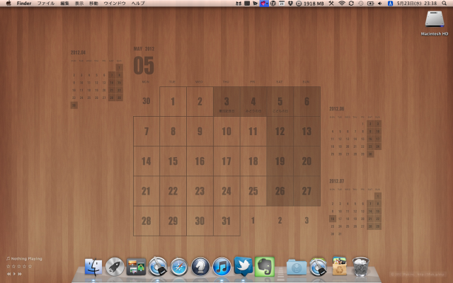
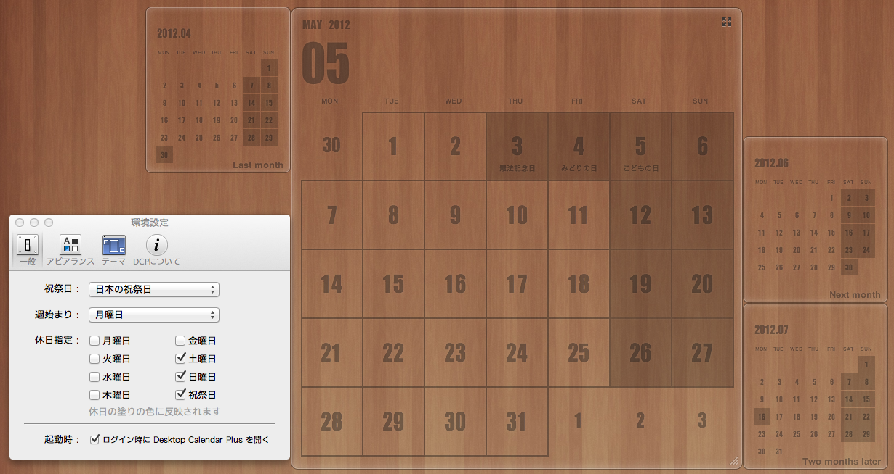

素敵なカレンダーを配布されている三階ラボさんがカレンダー表示アプリをリリースされていたので、  
今までのお礼もこめて買ってみました。

機能や使い方は上記公式サイトに丁寧に解説されています。

基本機能はデスクトップにカレンダーを表示できることですが、  
ちょっと感動したのがカレンダーのレイアウトをカスタマイズできること。  
環境設定を開くと下図のようにカレンダーが部品化されてドラッグできるようになります。  
これはすごい。

デフォルトで用意されたテーマを使うだけでも素敵。  
テーマは今後追加予定とのこと。  
また、icalなどとの同期も対応予定らしいです。

壁紙カレンダーの配布は終了されるらしいので、今後はこのアプリで楽しみたいと思います。  
記事執筆時セール中でした。お早めにどうぞ。
