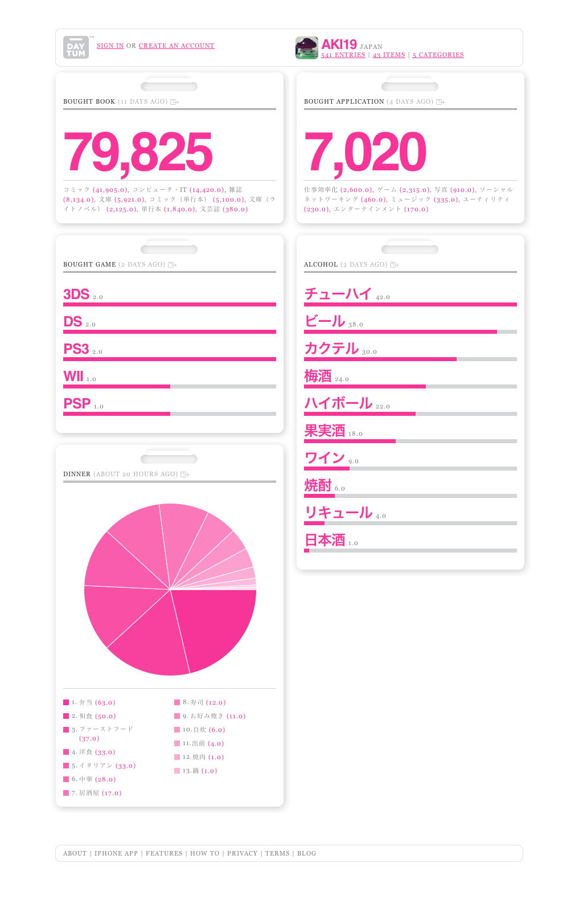
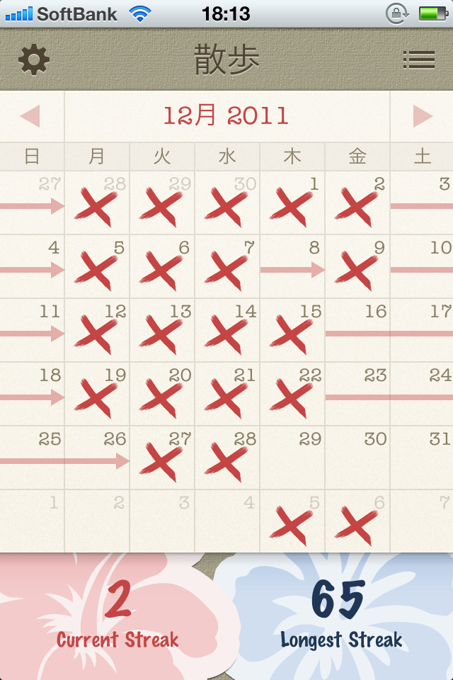
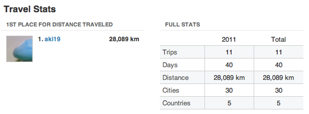

昨年の最後に、ライフログの記録を振り返ろうと思っていたのをすっかり忘れ、  
なおかつ年明け早々実家にMacのアダプターを忘れてしまい、  
ブログ更新が遅れてしまいました・・・。  
皆様、明けましておめでとうございます。

昨年は多くのWebサービスに出会い、これらのサービスを使ったライフログを  
本格的に生活に取り入れた年でした。

今回はTwitterなどを除いた、それらの目的別ライフログの振り返りをしてみようと思います。

<!--more-->

**Daytum**

まず、日々のいくつかの項目についてiPhoneアプリを通してDaytumに記録していました。

[私なりのDaytum活用方法]()

結果は以下の通りです。

<a href="http://daytum.com/aki19" target="_blank">http://daytum.com/aki19</a>

振り返ってみると、「コミック買い過ぎ」とか「iPhoneアプリそこそこ買ってる」とか面白いのですが、  
これを今年もそのまま続けるか・・・となると、ちょっと考えようかなと思っています。  
最初に記録しようとしていた物の中で、Daytumで記録することに意味がないと思えるものもありますし、  
「ディナー」は結局時間や場所の関係で選択の余地がないこともたくさんあったので・・・。  
また、記録する項目で記録日が重要になるようなものは、後に示すStreaksがいいかなと考えています。

<a href="http://daytum.com/" target="_blank">daytum</a>

**Streaks**

散歩した日や喫茶店に行った日を記録していました。  
カレンダーの日付をタップするだけなので、これはかなり楽しく記録出来ました。  
昨年は単純に実行日の記録をつけていただけですが、  
アプリの本来の目的であるモチベーションの維持に使ってみるのもいいかもしれません。

Streaks

Crunchy Bagel¥610posted with<a href="https://mama-hack.com/app-reach/" title="アプリーチ" target="_blank" rel="nofollow">アプリーチ</a>

**Tripit**

旅行の記録をつけていました。  
Googleカレンダーへの登録ついでに自動的に記録できていた感じです。  
これなら今後も自然に続けられそうです。  
今現在実家と離れた場所に住んでいるので、回数はそこそこ多いかも。

<a href="http://www.tripit.com/" target="_blank">tripit</a>

早いうちに色々見なおして、今年も楽しいライフログができるといいなと思っています。  
今年もAliceSystemsをよろしくお願いします！
