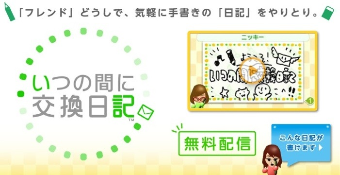
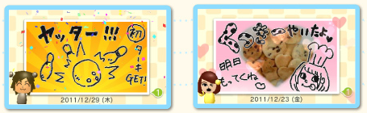

久々にゲームのお話。

最近Nintendo 3DSの「いつの間に交換日記」にはまっています。  
これは、ニンテンドーeショップから無料でダウンロードできて、  
登録した友達やすれ違った人に絵入りの手紙を送ることができるソフトです。

私は家族と離れて暮らしているので、連絡手段として今まで色々と試してきました。  
プライベートブログ、プライベートTwitterなどなど…。  
しかし家族はあまりパソコンを触らないので、  
更新及び更新を確認するのが面倒になってしまい、続きませんでした。

でも、この「いつの間に交換日記」なら自動受信設定にしておけば、  
3DSを開くだけで更新が確認できます。  
更新自体も手書きなのでPCに不慣れな家族にとっては圧倒的に楽。  
あまり長い内容には向きませんが、ちょっと元気にしてるかな？レベルの内容であれば充分使えます。

機能的にもなかなか良くできています。  
ペンは2Dと3Dを使い分けられて、手紙は4画面まで書くことができます。  
3DSでとった写真や音声を使うこともできます。  
書いたら送りたい人を選んで送信。  
誰にも送らなくてもオッケー。  
受信側は読んだあとにちょっとした感想を書くことができます。  
これも、相手に送信してもしなくてもオッケー。

私は絵が下手なのでアレですが、妹は器用に可愛い絵を送ってくれます。  
メールよりもちょっと嬉しいですよね。  
3DSがあればすぐにダウンロードできます。  
おすすめです！
