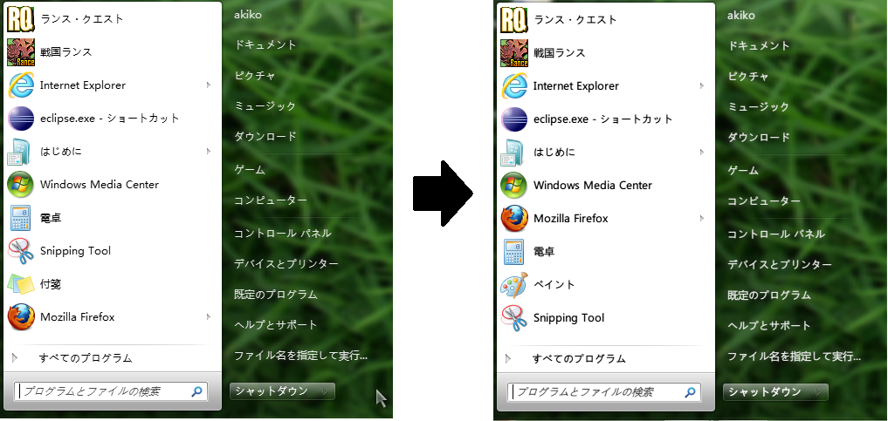

Windowsでも美しいフォントを使いたい・・・ということで、  
今までずっとgdippというフォントレンダリングソフトを使っていました。

<a style="color:#0070C5;" href="http://ryodesign.net/blog/2011/03/13/64bit%e7%94%a8%e3%82%bd%e3%83%95%e3%83%88%e3%82%a6%e3%82%a7%e3%82%a2%e3%81%a7%e3%82%82%e3%83%95%e3%82%a9%e3%83%b3%e3%83%88%e3%82%92%e7%b6%ba%e9%ba%97%e3%81%ab%e5%86%8d%e6%8f%8f%e5%86%99%e3%81%97/" target="_blank">64bit用ソフトウェアでもフォントを綺麗に再描写してくれるフォントレンダラ「gdipp」 | ryodesignblog</a>

が、久々にWindowsを起動し、chromeを更新すると、  
chrome上の文字がかすれてほとんど見えない状態に・・・。  
調べてみるとgdippとかgdi++とかと相性が悪くなってしまったようです。  
仕方ないのでgdippをアンインストールしてchrome再起動。  
これで直りました。

ただ、やはりフォントレンダリングソフトは使いたかったので、  
以下の記事を参考に「MacType」に乗り換えてみることにしました。

<a style="color:#0070C5;" href="http://did2memo.net/2012/04/02/chrome-mactype/" target="_blank">Chrome最新版でgdi++派生ソフトMacTypeを有効にする方法 | 情報科学屋さんを目指す人のメモ</a>

<a style="color:#0070C5;" href="http://did2memo.net/2012/04/06/mactype-20120406-install/" target="_blank">アップデートチェック機能を搭載したMacType最新版（2012.0406版）をインストールしてみた | 情報科学屋さんを目指す人のメモ</a>

私は以下のサイトからダウンロードしてインストールしました。

<a style="color:#0070C5;" href="http://code.google.com/p/mactype/downloads/list" target="_blank">Downloads &#8211; mactype &#8211; Ultimate font Rasterizer for Windows &#8211; Google Project Hosting</a>

結果はこんな感じです。  
（並んでいるプログラムについてはつっこまないでください・・・）

中国製のソフトですしインストーラーも中国語なので、自己責任でお願いします。  
（設定画面は微妙に日本語化されています。迷うことはないはず。）  
美しくなったかどうかは好みの問題なので！

とりあえずこれを使えばchrome最新版でもOKでした。
