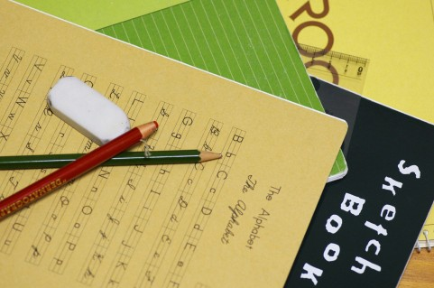

都会に戻ったためか文房具屋めぐりがマイブームです。  
今回は、最近買った文房具をいくつかご紹介したいと思います。

<!--more-->

<a style="color:#0070C5;" href="http://item.rakuten.co.jp/zakka-soho/10004759/" target="_blank">【楽天市場】BOOKMARKER with PENHOLDERペンホルダー付きブックマーカー【期間限定】配送料割引キャンペーン中!!：蘇峰-SOHO-（インテリア雑貨）</a> 

ブラックを購入しました。  
モレスキンにつけようかなと思ったのですが、つけながらメモするのが厳しかったので断念。  
書類入れにひっかけて使ってます。  
直径1.2cmのペンまでOKなのでちょっと太めの三色ボールペンを入れてます。便利。

  

  <a href="http://calamel.jp/%E2%98%86%E3%80%80%E3%82%B3%E3%82%B3%E3%83%95%E3%82%BB%E3%83%B3%E3%80%80coco%20fusen%20%E3%80%80CF-2002/item/1007248197?afid=aki19" target="_blank">☆　ココフセン　coco fusen 　CF-2002</a> 価格：399円(税込) ショップ： <a href="http://calamel.jp/%E6%96%87%E5%85%B7%E9%80%9A%E8%B2%A9%E3%81%AEWeb%20TENSHINDO/shop/MS00032998?afid=aki19" target="_blank">文具通販のWeb TENSHINDO</a>

ケースごと貼って使える付箋です。これは柄物ですが、単色もあります。  
４ケースあるので色々な場所に置いて使ってます。かわいい。

  

  <a href="http://calamel.jp/%E5%8D%B0%E9%91%91%E3%82%B1%E3%83%BC%E3%82%B9%28%E6%9C%B1%E8%82%89%E4%BB%98%E3%81%8D%29/item/32318945?afid=aki19" target="_blank">印鑑ケース(朱肉付き)</a> 価格：1,102円(税込) ショップ： <a href="http://calamel.jp/%E3%83%9F%E3%83%8D%E3%83%83%E3%83%88%E3%81%AFPUT%20ON%E3%80%81Si-Si-Si%E3%80%81%E5%80%89%E6%95%B7%E6%84%8F%E5%8C%A0%E8%A8%88%E7%94%BB%E5%AE%A4%E3%80%81%E3%81%A4%E3%81%8F%E3%81%97%E6%96%87%E2%80%A6/shop/PA01077170?afid=aki19" target="_blank">ミネットはPUT ON、Si-Si-Si、倉敷意匠計画室、つくし文具店、かみの工作所、文房具を集まった広島の雑&#8230;</a>

ドット柄の朱肉付き印鑑ケースです。可愛いし便利！  
それまではゼクシィの付録を使っていたので進歩です・・・。

  

  <a href="http://calamel.jp/%E3%82%A2%E3%82%A4%E3%82%B9%E3%82%AF%E3%83%AA%E3%83%BC%E3%83%A0%E6%9F%84%E3%81%AE%E3%83%87%E3%82%B3%E3%83%AC%E3%83%BC%E3%82%B7%E3%83%A7%E3%83%B3%E3%83%86%E3%83%BC%E3%83%97%E3%80%80%E3%83%87%E3%82%B3%E3%83%A9%E3%83%83%E3%82%B7%E3%83%A5/item/46046126?afid=aki19" target="_blank">アイスクリーム柄のデコレーションテープ　デコラッシュ</a> 価格：294円(税込) ショップ： <a href="http://calamel.jp/%E3%82%B9%E3%82%A4%E3%83%BC%E3%83%84%E9%9B%91%E8%B2%A8%20%E2%99%AA%20%E3%81%8B%E3%82%8F%E3%81%84%E3%81%84%E9%9B%91%E8%B2%A8%E3%81%AE%E9%80%9A%E8%B2%A9%E3%82%B5%E3%82%A4%E3%83%88%E3%80%80Sweets3D/shop/PA01148557?afid=aki19" target="_blank">スイーツ雑貨 ♪ かわいい雑貨の通販サイト　Sweets3D</a>

ついに買っちゃいました。デコラッシュ。  
実際使うのかなって感じですが、ハンズのセールで本体＋テープ２種がセットで安かったので購入。  
ハリネズミ＋アイス＋ハナ２です。（あまり選ぶ余地はなかった）  
思ってたよりも正確に出力されます。  
マステも使えない自分には難易度の高いアイテムですが・・・。

夫がプレゼントしてくれた「ぺんてる ランスロット3シリーズ 万年筆細字」です。  
上品なピンク色と細字が気に入ってます。書きやすいです。  
<a href="https://www.justmyshop.com/app/servlet/item?item_code=7008445&#038;w=search_detail_7008445#detail01" title="Just MyShop" target="_blank">ここ</a>で買ってもらいましたがお買い得です。  
今見たら残数１でした。他の色もあります。

以上です。  
次は新しいモレスキン用のアイテムが欲しいなー。
