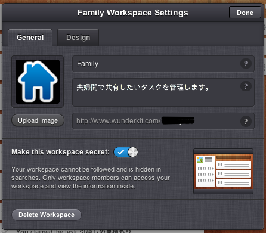
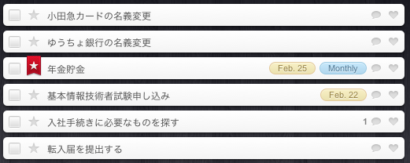
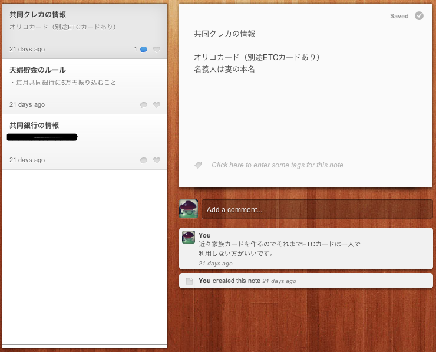
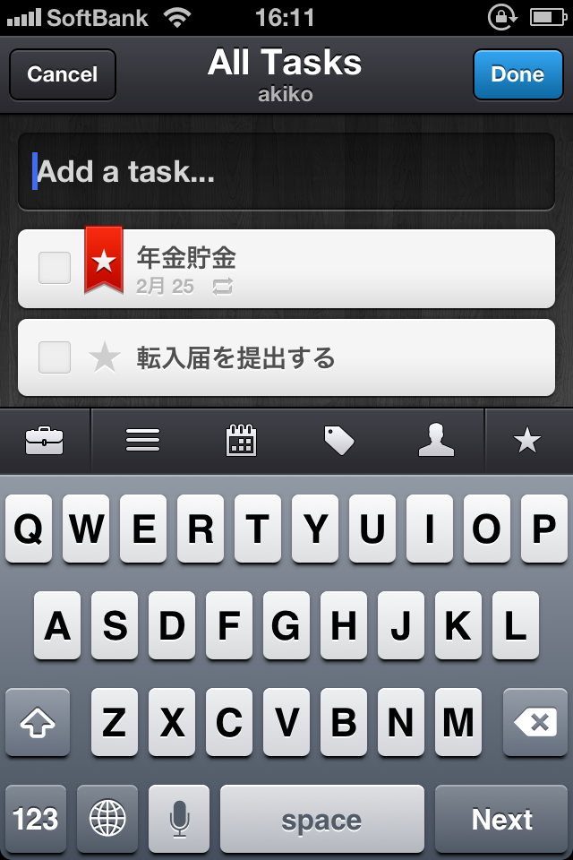

美しいタスク管理サービス「Wunderlist」。  
その後継である「Wunderkit」がオープンβになり最近になって無料有料の壁も見直され、  
おすすめできるレベルになってきました。  
（有料版の違いについては後述します）

もともと私はタスク管理をToodledoで行なっているのですが、  
プライベートタスクはこっちに移して何日か使ってみたところ、  
特にタスクを共有する部分がとても楽しく、かちっとしたUIも気に入ったので、  
その感想をまとめてみたいと思います。

<!--more-->

※「Wunderkit」はまだベータなので今後仕様が変更される可能性があります。  
以下は2012/2/17時点のレポートです。  
※βテストは有料ユーザーとして始まったので、以下は有料ユーザーだけが使える機能を含んでいるかもしれません。  
違いを確認の上、ご検討ください。

■基本的な機能

まず、タスクはWorkspaceを作成して管理します。  
これは「仕事」、「プライベート」などコンテキストの違うタスクを区別するようなものです。  
私は、「私個人のタスク」、「妻としてのタスク」という2つのWorkspaceを作りました。  
Workspaceには他のユーザーを招待することもできます。

各Workspaceでは進捗が一目で分かるダッシュボードやタスク、ノートを管理することができます。  
タスクはリストでグルーピングできます。  
タスクやノートにはコメントや「いいね！」のようなハートをつけることもできます。

タスクの属性は以下が設定可能です。

・スター  
・期日（繰り返し設定可能）  
・タグ  
・アサインしたいユーザー

スターをつけたタスクや期日の近いタスクはワンステップで確認できる位置に表示されるようになります。  
アサインしたユーザーがタスクを完了させるとタスク作成者にメールがくるので安心です。  
（このあたりは二人でテストした結果なので正確ではないかもしれません。）

現在のところ、Webアプリ、Macアプリ、iPhoneアプリで操作できます。

特に私が気に入った点はコメントとノート。  
なんにでもコメントを残せるので、進捗率などをメモしておくと共有相手が安心できるのではないでしょうか。  
ノートでは好きなことをメモして残しておけるので、  
私の場合、夫婦で共有しておくべき銀行情報や保険のことについてまとめています。

■Web版  
左側にWorkspace選択バー、右側に各Workspaceの内容が表示されるレイアウトなので、  
Workspaceの遷移が楽で使い勝手がいいと思います。  
逆に言うと、iPhone版ではWorkspace内のタスク一覧画面から他のWorkspaceのタスク一覧画面に移動する時の  
ステップが多くて面倒・・・。これはなんとかしていただきたいところ。

■iPhone版  
Workspace全体での進捗履歴が確認できるStream機能が使えます。  
また、ゴミ箱のクリアができるのは現状iPhoneアプリのみです！  
スタータスクなどはアプリバッジを表示することもできます。

タスクを追加するときに表示される属性設定バーがとても便利。

■どこから有料なのか？  
毎月$4.99で有料ユーザーになれます。  
Workspaceを作ったり他の人を招待したりは無料ユーザーでも可能です。  
有料だと、今後実装予定のストレージ機能の容量が増えたり、  
タスクに優先度やグループが設定できるようです。

詳しくは以下のページをご覧下さい。  
<a href="http://get.wunderkit.com/pro/" target="_blank">http://get.wunderkit.com/pro/</a>

まだベータなので全ての機能が揃っているわけではなく、  
発表されている限りではToodledoほど高機能なサービスではありませんが、  
現状も必要十分な機能を備えたサービスだと思います。  
特にタスク共有の面ではなかなか考えられて作られているなぁと思いました。  
今後ストレージ機能もつけば、グループウェアとしても使えそう。  
listはいまいちピンとこなかったのですが、kitはこれからも使い続けたいと思います。

<a href="http://get.wunderkit.com/" target="_blank">http://get.wunderkit.com/</a>  
（Macアプリも公式HPからどうぞ）
