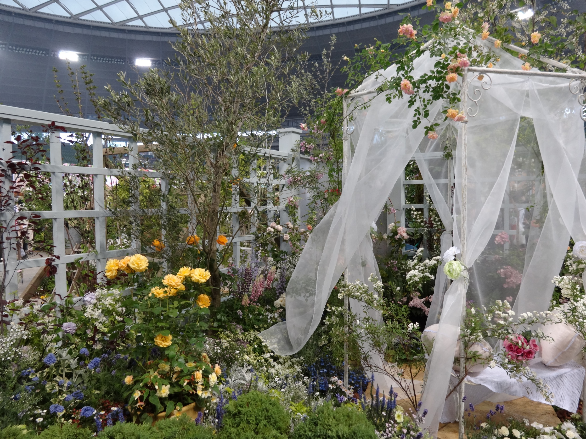
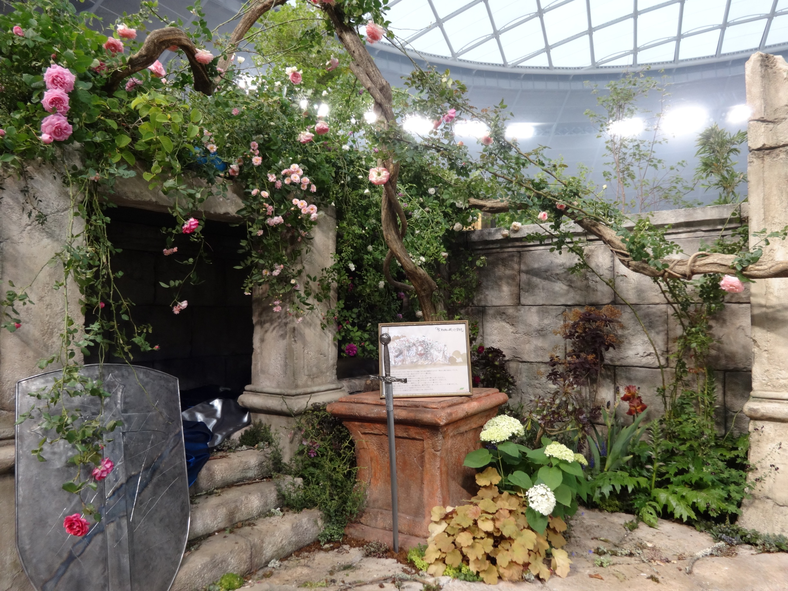
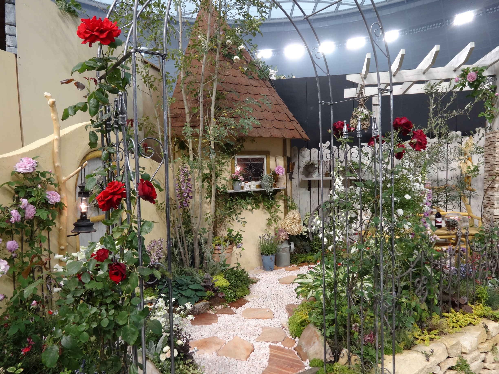
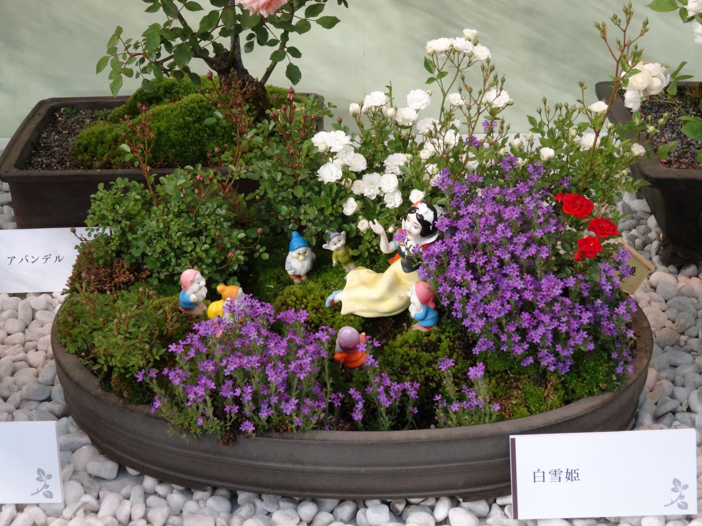
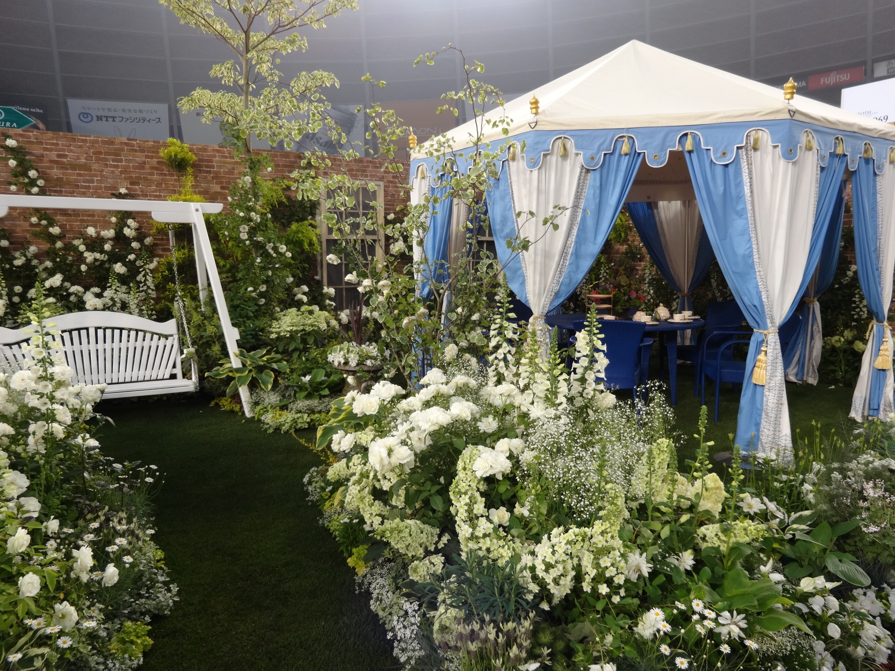
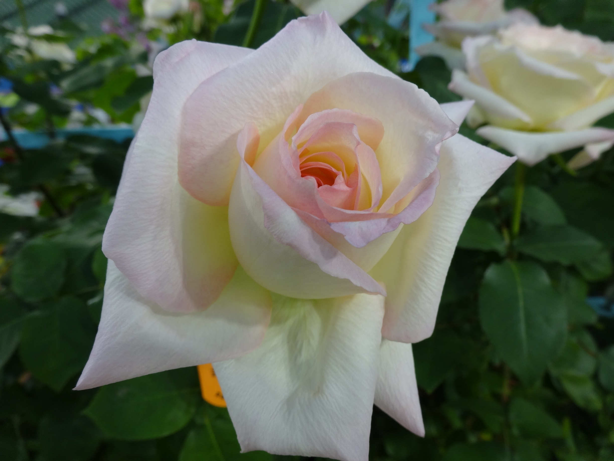

写真はiPhoneで充分、と思っていたのですが、  
やはりズームやマクロ撮影に弱いので思い切ってデジカメ買いました。

ソニー Cyber-shot DSC-WX300(B) ブラック

<!--more-->

サイバーショットは初めてでしたが、  
この機種は起動も早いし、いちいち自分でシーン選択しなくても  
状況に応じて自動的に適切な設定にしてくれるので便利。  
というかカメラからずいぶん離れていたので、  
最近のデジカメは賢いんだなーと感動しました。

そしてそして・・・  
ずっと楽しみにしていた「<a href="http://www.bara21.jp/15kai/index.html" title="国際バラとガーデニングショウ" target="_blank">国際バラとガーデニングショウ</a>」に行ってきました！  
15周年イベント盛りだくさん。  
ガーデンコンテストもあるので、バラ以外の花も楽しめます。  
夫と行ったのですが、行く前は興味無さそうにしていたのに会場入りしてからはバシバシ写真撮ってました。

新しいカメラで撮影した写真をいくつか・・・。

会場は西武球場なので雨の日でも大丈夫です。  
当日券は2000円ですが、公式HPの割引券で1800円になります。  
5月16日まで！

 [1]: http://www.amazon.co.jp/gp/product/B00BQ6VHQI/ref=as_li_ss_il?ie=UTF8&camp=247&creative=7399&creativeASIN=B00BQ6VHQI&linkCode=as2&tag=check-22
 [2]: http://www.amazon.co.jp/gp/product/B00BQ6VHQI/ref=as_li_ss_tl?ie=UTF8&camp=247&creative=7399&creativeASIN=B00BQ6VHQI&linkCode=as2&tag=check-22
