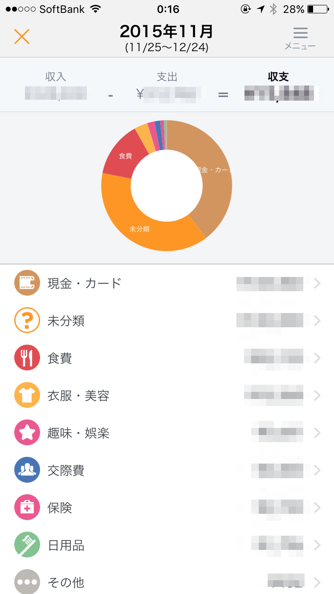
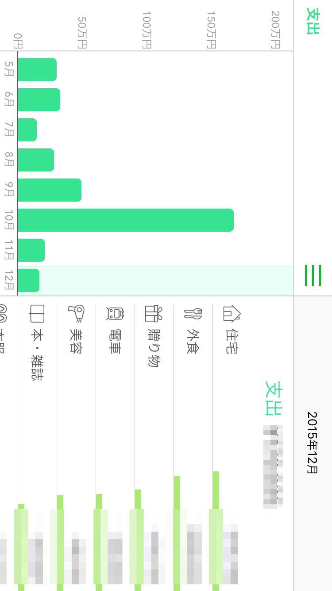
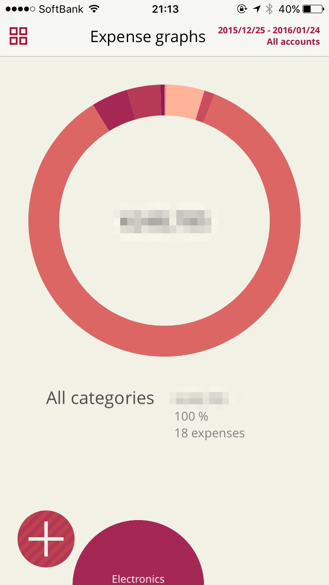
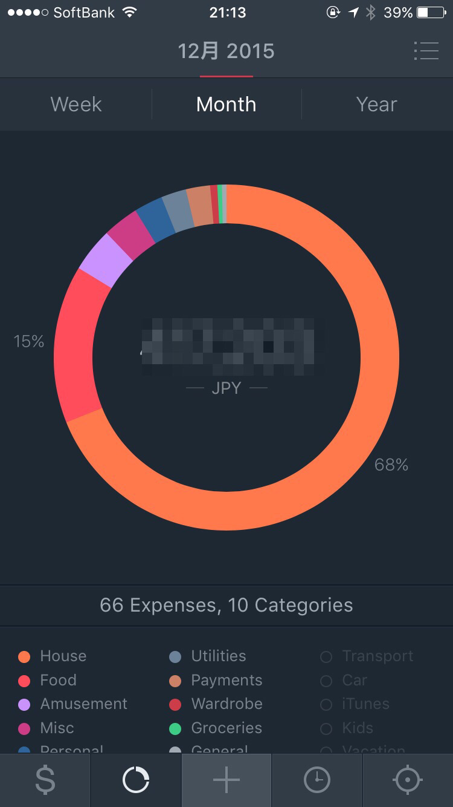

昔使っていたToshl Financeのバージョンアップβテストに参加したことをきっかけに、  
支出管理アプリをもう一度見直してみました。

主に銀行の残高一括確認のために、Moneytreeをずっと使っていたのですが、  
現金についても記録したいな・・・と改めて。  
昔から生活スタイルが変わった時には1,2ヶ月使って支出を確認していたのですが、  
昔使っていたアプリはことごとく動かなくなってしまっていたので・・・。

使ってみたのは、Money Forward、Moneytree、Toshl Finance、Saver 2です。

<!--more-->

最初にこれはあわないな・・・と脱落したのはMoney Forwardでした。  
無料で銀行・カードと連携して残高情報をひっぱってきてくれるのは良かったのですが、  
とにかく広告が気になって・・・。  
ひとつ支出を入力するたびに小窓で広告が表示されるのはやっぱり邪魔でした。

マネーフォワード ME - 人気の家計簿(かけいぼ)

Money Forward, Inc.無料posted with<a href="https://mama-hack.com/app-reach/" title="アプリーチ" target="_blank" rel="nofollow">アプリーチ</a>

次に普段使っているMoneytree。  
こちらも無料で残高照会できて、バージョンアップしてからはUIもシンプルで良いです。  
現金記録をすると、ちゃんとATM引き出し額から差し引いて計算してくれるので賢い。  
ただ、現金記録のUIはそこまで使いたい！という感じではないんですよね。アイコンもあまり惹かれない・・・。

Moneytree 家計簿より楽チン

Moneytree無料posted with<a href="https://mama-hack.com/app-reach/" title="アプリーチ" target="_blank" rel="nofollow">アプリーチ</a>

あとの２つは口座連携機能はなく、現金記録オンリーになります。

βテストからそのまま使っています。  
アイコンはなく、カテゴリ・タグ管理。  
期間を自分で決められるので給料日起点で管理したい私にとっては◎。  
収支を川にみたてて残金を可視化するUIもなかなかおもしろいです。

Toshl Finance - Best Budget

Toshl Inc.無料posted with<a href="https://mama-hack.com/app-reach/" title="アプリーチ" target="_blank" rel="nofollow">アプリーチ</a>

アイコンもUIもシュッとしててかっこいい。  
こちらもカテゴリ・タグ管理できます。  
アイコンを増やしたり期間の変更をしたりしたければ、アドオン購入が必要で、  
これがちょっと高くて・・・。  
デフォルトのアイコンだけだとちょっと足りないなーって感じなんですよね・・・。

以上、一ヶ月くらい平行して使ってみましたが、  
どれも一長一短で・・・。  
口座の残高一括確認はやはり欲しい機能なので、Moneytreeと、  
現金記録が手軽にできたToshl Financeを使って、  
ちょっと面倒ですが月一で各カテゴリの合計額を転記するなどして  
無理やりまとめて管理しようかなと思っています。
