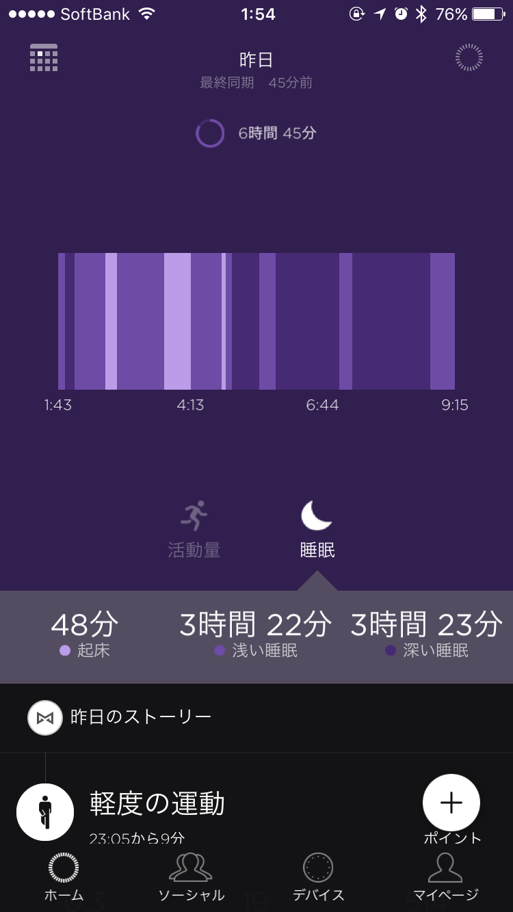

<a href="http://jp.misfit.com/products/ray/" target="_blank">MISFIT RAY</a>買いました。  
私にとって初めての活動量計です。

散歩が趣味なので活動量計自体はずっと気になっていたのですが、  
気に入ったデザインがなく今まで見送ってきました。  
RAYは発表された時からこのデザインなら毎日つけたい！と注目していて、  
日本で発売が開始されたので予約して即購入しました。  
届いてから二日間ずっとつけていますが、  
軽いし、普通のブレスレットみたいで大変良いです。  
ネックレス型など今後アクセサリーが追加されていくようなのでとても楽しみ。

睡眠ログについては正直精度を疑っていたのですが、  
特に意識することなく睡眠の開始と終了がかなり正確にでて驚きでした。  
睡眠ログは初めてとったのでグラフを見るだけでも面白い・・・。

また、トリプルタップに好きなアクションを割り当てることができるので、  
私にとってはこれが地味に便利でした。  
普段使っているイヤフォンでは再生と停止しかできなくて。  
曲送りが欲しかったんですよ。なので重宝してます。  
IFTTTのレシピも呼べるのでいろいろ出来そう。  
ただし現在はトリプルタップしか使えないのでここは改善されてほしいですね。

ここ最近で一番満足した買い物だったかもしれません。  
ログがたまるともっと面白くなると思うので使い倒してみたいと思います。
