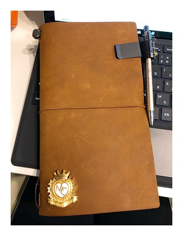

毎年、紙の手帳、記録ノート、壁掛けカレンダー、机上カレンダーを使って一年を過ごします。  
久しぶりのブログではこれらについて、去年と今年の記録をつけておこうかなと思います。

#### 手帳

去年は、ほぼ日手帳オリジナルのMOTHER2デザインでした。MOTHER2デザインが出てからはずっとほぼ日です。  
今年は、初めてのほぼ日手帳weeks。今回もMOTHER2デザインです。かわいい。

<a href="https://www.1101.com/store/techo/ja/2018/pc/detail_cover/wb18_mothermagicant.html" target="_blank" rel="noopener">MOTHER2 / マジカントのちず [weeks]</a>

#### 記録ノート

去年は、紳士なノートのハードカバー版でした。紙がしっかりしていて書いていて気持ちよかった。ただ、感想記録に暮らしのキロクを使うようになったのですが、これのサイズが少し大きくて横に貼る形になってしまったのでちょっと困っていました。なのでこれを機に変更。

今年は、初めてのトラベラーズノート。使い込んでいくうちにいい感じになることを期待して・・・なるべく今後は中のリフィルを替える感じで使い続けていきたいなと思っています。

色々カスタマイズ方法も調べたのですが、ひとまずはピンズだけつけました。  
このピンズは応援しているゲームの返礼品でもらったものです。

#### 壁紙カレンダー

去年も今年も大槍葦人さんのかわいいかわいい少女カレンダーです。幸せー。  
今年分は通販をお願いしたので受取はこれから。

#### 机上カレンダー

去年も今年も<a href="http://webcitron.com/works/calendar/" target="_blank" rel="noopener">citronworks*</a>さんのかわいいかわいいカレンダーです。

今年もこれらの素敵な物に囲まれて楽しく過ごしていけたらなと思います。
