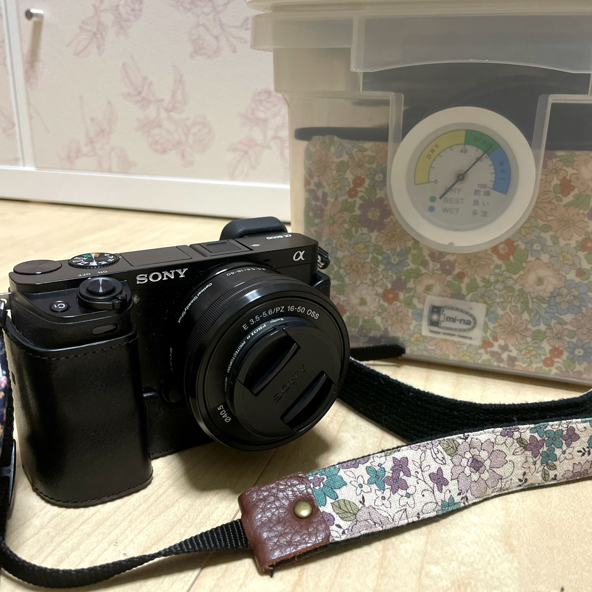
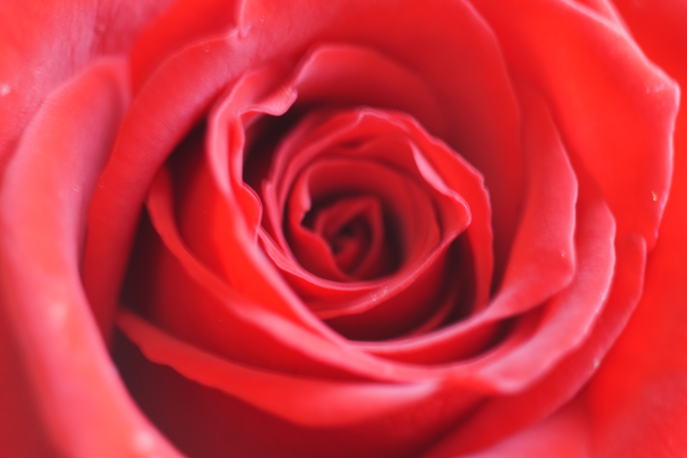
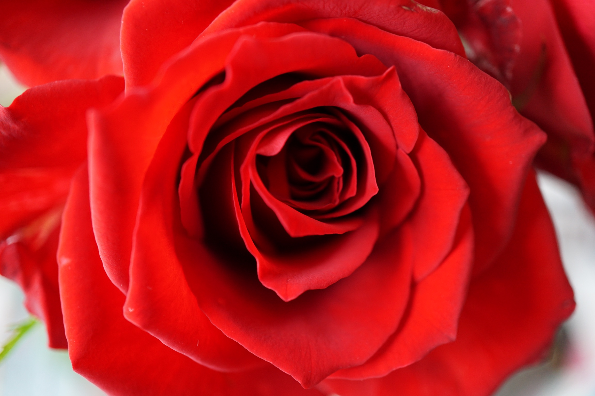

レンズを買い足した話をしたかったのですが、
もともと使っているカメラについて書いていなかったですね・・・。

2013年ぐらいにCyber-shotを買ったことは書いていましたが、 2017年から別のカメラを使っています。
一緒に買ったものも含めてまとめちゃいます。

<a target="_blank" href="http://www.yodobashi.com/ec/product/100000001002142875/index.html">SONY
ILCE-6000L B [α6000 (アルファ6000) パワーズームレンズキット ボディ＋交換レンズ「E PZ 16-50mm F3.5-5.6 OSS」 ブラック]</a>

<a target="_blank" href="http://www.yodobashi.com/ec/product/100000001002761859/index.html">SONY
LCS-EBE BC [α6000専用 ボディケース ブラック]</a>

<a target="_blank" href="http://www.yodobashi.com/ec/product/100000001002072413/index.html">Kenko
40.5 S PRO1D プロテクター BK プラス [保護フィルター 40.5mm]</a>

<a target="_blank" href="http://www.yodobashi.com/ec/product/100000001003386541/index.html">Kenko
マスターGフィルム ソニー [保護フィルム α6500/α6300/α6000用]</a>

<a target="_blank" href="http://www.yodobashi.com/ec/product/100000001001627846/index.html">SONY
FA-SHC1M [シューキャップ]</a>

<a target="_blank" href="http://www.yodobashi.com/ec/product/100000001002625450/index.html">HAKUBA
KMC-61LBK [ハイパワーブロアープロ L ブラック]</a>

<a target="_blank" href="http://www.yodobashi.com/ec/product/100000001002625433/index.html">HAKUBA
KMC-LP17BKT [レンズペン3 プロキット ブラック]</a>

<a target="_blank" href="http://www.yodobashi.com/ec/product/100000001002365409/index.html">トランセンド
TS32GSDHC10U1 [SDHCカード 32GB Class10 UHS-I対応]</a>

<a target="_blank" href="https://minne.com/items/6790282">YUWA花柄・カメラストラップ（パープル系）</a>

<a target="_blank" href="http://www.mi-na.co.jp/fs/mina/80077-016">インナーケース付きドライボックス　8Ｌ/ノスタルジックフラワー</a>

これに最近、<a href="//ck.jp.ap.valuecommerce.com/servlet/referral?sid=3600888&pid=887188231&vc_url=https%3A%2F%2Fck.storematch.jp%2Frd%3Fv%3D4.0%26c%3Da%26cat%3DDL%26code%3Dcamera-no-ohbayashi_4905524796629%26date%3DcgKjfP%26debug%3D0%26ecsite_id%3D1%26ope%3D2%26pos%3D1%26qid%3DZV%26rid%3DYNxEVwACBI63T_unCoMhHAqDAPrScA%26rqcat%3D0%26sig%3DPysC7r0mQprrzl5BLrxEmdROdBJwhxUGZ7XYcVN2PiE%3D%26site_browser_id%3D4714963f80917e8640dd1018c70297d4cd1b4a80d2fe21a7321d8b0e9b878d75%26site_user_id%3D%26target_roas%3D%26uid%3DgLV%26url_type%3D0%26bfp%3Dd91e64baf514b0f276c7dbe95fa0663600d852de" rel="nofollow">SONY SEL30M35 [E 30mm F3.5 Macro 30mm/F3.5 ソニーE]</a>を買い足しました。
本体がブラックなので、シルバーしかないのがちょっと残念ですが・・・。

レンズフィルターも買いました。<a href="//ck.jp.ap.valuecommerce.com/servlet/referral?sid=3600888&pid=887188231&vc_url=https%3A%2F%2Fpaypaymall.yahoo.co.jp%2Fstore%2Fy-sofmap%2Fitem%2F4961607509425%2F%3Fsc_i%3Dshp_pc_search_itemlist_shsrg_title%26ea%3D01" rel="nofollow">Kenko 49 S PRO1D プロテクター プラス [保護フィルター 49mm]</a>を買いましたが、レンズフード側ならちゃんとハマりました。
（純正品の場合はレンズ側に装着できるみたいです）

もともと撮影する写真が、人物よりは花とかが多く・・・
めちゃくちゃ接写して撮る構図を試したかったので買いました！

買う前、同僚に<a target="_blank" href="https://prtimes.jp/main/html/rd/p/000000069.000034826.html">LOMO SMENA 8M</a>を借りてやっぱマクロレンズいいな・・・と思い・・・
そのときに撮影した写真はこちら。

このレンズもまた不思議なレンズで、トイカメラのレンズを一眼レフに取り付けできる用に改造されたもの、みたいです。
自分でピントあわせないといけないので上から花を撮るのは手ブレが酷くて難しかった・・・。

SEL30M35で撮った写真はこちら。

レンズの差よりピントの問題な気もしますが・・・。
カメラはいつまでも素人なので、今同僚から色々教わってます。
キャンプ風景とかペットとか・・・もっとうまく撮れるといいな・・・。
