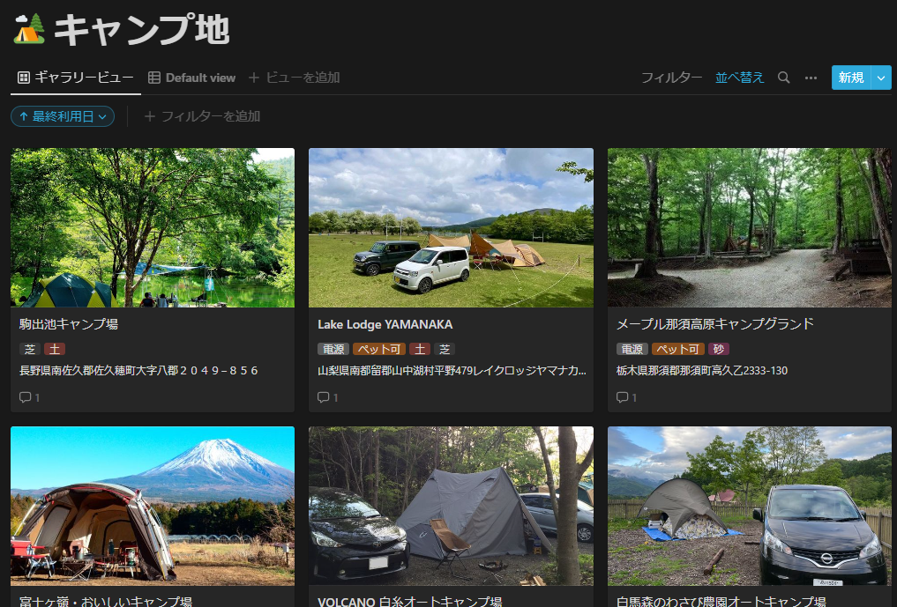
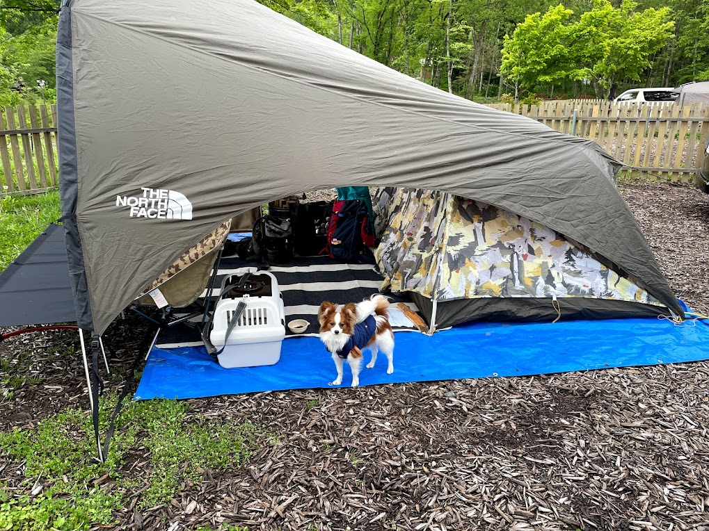

今まで行ったキャンプ地はNotionに下図のようにまとめています。

ギャラリービューで見ると（ほとんど似たような写真になりがちですが）
面白くて気に入っています。

自分の場所選びの基準は夫の希望を聞いているだけですが、
高規格・・・設備がきれいなこと。寒い時期は電源があること。

最近はドッグサイト中心に車横付け可能な場所を選ぶことが多いです。
あとはやっぱり芝とか・・・地面がごつごつしていない場所がいいですね。

ちょっと困っていることとして、人気のキャンプ地はだいたい場所が決まっているので
東京から車で行くとなるとけっこう同じような場所になることが多くなってきました。
本当はもっといろいろなところに行ってみたいのですが・・・。
車以外で考えるともっと荷物を減らさないと・・・。
どんどん荷物が増えています。

荷物が増える話をしているのに、最近はもっと大きなテントが欲しくなってきました。
今使っているのはノースフェイスのホームステッドルーミー2。

デザインはめちゃくちゃ気に入っているのですがちょっと狭く感じてきました。
理想はテント内で立っても頭をぶつけない高さ。
形はドーム型がいいのですがどれも高いですね・・・。
しばらく悩みそうです。

